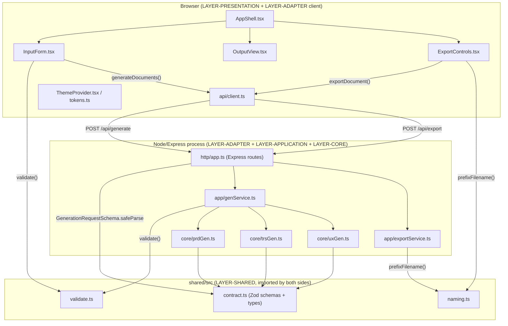

# SpecPilot — Application Architecture

> Analysis basis: static reading of the repository at [SpecPilot-main](.) as of 2026-08-23.
> All statements are **Confirmed** (directly observed in code) unless explicitly marked
> **Inferred** (reasonable deduction not literally stated) or **Unknown** (could not be
> determined from the repository).

---

## Executive Summary

**What this application does** (Confirmed — [Spec.md](Spec.md), [README.md](README.md)):
SpecPilot is a single-page web application that turns a short product description into
first-draft documentation. A user types a **Product Title** and **Product Details**, selects
one or more of three document types, and clicks **Generate**. The system deterministically
produces:

- a **Product Requirements Document (PRD)** — 9 fixed sections,
- a **Technical Requirements Specification (TRS)** — 12 fixed sections,
- **UX Design Mockups** — user journeys + ASCII/markup UI mockups.

The user can switch between the generated segments, edit the text inline, export the current
document to Word (`.docx`) or PDF, and download the UX mockups as a self-contained HTML file.
Regenerating replaces prior output for the regenerated types.

**Business purpose** (Confirmed — [Spec.md](Spec.md) mission statement): give product
managers, business analysts, engineers, and designers a structured starting draft instead of a
blank page, without depending on an external LLM provider and without persisting user content
server-side.

**Primary functionality** (Confirmed):
1. Capture product title/details and document-type selection.
2. Validate the request (client- and server-side, same rules).
3. Generate deterministic, template-based documents.
4. Display documents in switchable, editable segments.
5. Export to Word/PDF or download UX mockups as HTML, with filenames prefixed by product title.

**Expected users** (Confirmed — [Spec.md](Spec.md) mission statement): product managers,
business analysts, engineers, and designers. No authentication or user accounts exist
(Confirmed — Non-Goals in [Spec.md](Spec.md); no auth code found in [server/src](server/src)).

---

## Technology Stack

Identified from [package.json](package.json), [tsconfig.json](tsconfig.json),
[vite.config.ts](vite.config.ts), [vitest.config.ts](vitest.config.ts), and [Dockerfile](Dockerfile).

| Category | Technology | Evidence |
| --- | --- | --- |
| Language | TypeScript 5.5 (strict mode), compiled/executed via Vite/vite-node/Node's `--experimental-strip-types` | [tsconfig.json](tsconfig.json), [Dockerfile](Dockerfile) |
| Frontend framework | React 18 (`react`, `react-dom`) | [package.json](package.json) |
| Frontend build tool | Vite 5 with `@vitejs/plugin-react` | [vite.config.ts](vite.config.ts) |
| Backend framework | Express 4 | [server/src/http/app.ts](server/src/http/app.ts) |
| Backend runtime | Node.js 20 (Alpine base image) | [Dockerfile](Dockerfile), [README.md](README.md) |
| Validation | Zod 3 (shared schemas) | [shared/src/contract.ts](shared/src/contract.ts) |
| Word export | `docx` npm package | [server/src/app/exportService.ts](server/src/app/exportService.ts) |
| PDF export | Hand-rolled, dependency-free single-stream PDF writer (no `pdfkit` despite being mentioned as a design intent in [design.md](design.md)) | [server/src/app/exportService.ts](server/src/app/exportService.ts) — **Inferred discrepancy**: design.md states `pdfkit` is used, but the actual code builds the PDF manually with string concatenation. This is a **Confirmed** implementation fact and a **documentation drift risk**. |
| UX mockup export | Self-contained HTML string (`text/html`) | [server/src/app/exportService.ts](server/src/app/exportService.ts) |
| Database | None present (Confirmed — no ORM, driver, or connection string anywhere in the repo) | — |
| External APIs / LLM providers | None (Confirmed — ADR explicitly rejects this; see [adr/ADR-DETERMINISTIC.md](adr/ADR-DETERMINISTIC.md)) | — |
| Testing | Vitest 2, `@testing-library/react`, `jsdom`, `supertest` | [package.json](package.json), [vitest.config.ts](vitest.config.ts) |
| Coverage | `@vitest/coverage-v8` + custom gate script | [scripts/coverage-report.mjs](scripts/coverage-report.mjs) |
| Deployment | Multi-stage Docker build → single Node 20 Alpine container serving built static assets + server source directly | [Dockerfile](Dockerfile) |
| Smoke testing | POSIX shell script hitting `/health` | [deploy/smoke.sh](deploy/smoke.sh) |

---

## High-Level Architecture

**System design** (Confirmed — [design.md](design.md)): a layered, "dependency-inward"
architecture with a pure, deterministic generation core wrapped by thin I/O shells. This is an
**npm-workspaces-style monorepo** (three top-level TypeScript source roots — `shared/`,
`server/`, `web/` — all included in one [tsconfig.json](tsconfig.json), though no `workspaces`
field exists in [package.json](package.json); it is a **single package**, not true npm
workspaces — **Confirmed** by inspecting `package.json`, which is a **correction** to the
`design.md` claim of "npm workspaces monorepo").

**Layers**, from outermost to innermost (Confirmed — [design.md](design.md), matches code
layout):

1. **Presentation** (`web/src/**`) — React components, theming. No direct network/file I/O.
2. **Adapter** (`web/src/api/client.ts`, `server/src/http/**`) — browser fetch client and
   Express HTTP surface; all network/serialization side effects live here.
3. **Application** (`server/src/app/**`) — orchestrates validation + calls into core generators
   (`genService.ts`) and builds export files (`exportService.ts`).
4. **Core** (`server/src/core/**`) — pure, deterministic template generators with no I/O.
5. **Shared** (`shared/src/**`) — contract types (Zod schemas), validation rules, filename
   logic; used by both front-end and back-end, depends on nothing else.

Dependency direction is acyclic and points inward: Presentation/Adapter → Application → Core,
and every layer may depend on Shared (Confirmed — [design.md](design.md) and verified by
imports in [server/src/app/genService.ts](server/src/app/genService.ts) and
[web/src/features/input/InputForm.tsx](web/src/features/input/InputForm.tsx), both of which
import from `shared/src/*` directly via relative paths, not a package alias).

**Component interactions** (Confirmed by import graph):
- `web/src/App.tsx` composes `InputForm`, `OutputView`, `ExportControls`, wrapped by
  `ThemeProvider` inside `AppShell`.
- `InputForm` calls `generateDocuments()` (in `web/src/api/client.ts`), which `POST`s JSON to
  `/api/generate`.
- The Vite dev server proxies `/api` and `/health` to `http://localhost:3000`
  ([vite.config.ts](vite.config.ts)) — i.e., the front-end and back-end run as **separate
  processes in development** and are combined only via Docker in production, where the server
  additionally serves the built static assets (**Inferred**: the Dockerfile copies `dist/` into
  the runtime image, but [server/src/http/app.ts](server/src/http/app.ts) contains **no
  `express.static` call**, so the production container does **not** actually serve the built
  front-end — this is a **notable architectural gap**, see Architectural Risks).
- `server/src/http/app.ts` routes `/api/generate` to `genService.generate()` and `/api/export`
  to `exportService.buildExport()`.
- `genService.generate()` validates via `shared/src/validate.ts` then calls
  `core/prdGen.ts`, `core/trsGen.ts`, `core/uxGen.ts` depending on `selectedTypes`.
- `exportService.buildExport()` dispatches to `buildWord`, `buildPdf`, or `buildMockup`, all of
  which call `shared/src/naming.ts::prefixFilename` for the output filename.

**Statelessness** (Confirmed — [server/src/http/app.ts](server/src/http/app.ts) sets
`Cache-Control: no-store`; no database, session store, or file write appears anywhere in
`server/src`): every request is processed in memory and nothing is retained after the response
is sent, matching `NFR-DATA-NOPERSIST` in [Spec.md](Spec.md).

### Architecture Diagram



---

## Repository Structure

```
SpecPilot-main/
  design.html, design.md        # Design document (source of design.md content)
  plan.html, plan.md            # Work plan (not analyzed in depth; planning artifact)
  Spec.md                       # Software Requirements Specification (source of truth for behavior)
  README.md                     # Quick start / project layout summary
  Dockerfile                    # Multi-stage build → single runtime container
  package.json                  # Single npm package (not true workspaces) with all scripts/deps
  tsconfig.json                 # Strict TS config covering shared, server, web, tests
  vite.config.ts                # Frontend dev server + build config, /api and /health proxy
  vitest.config.ts              # Test runner config (node env, coverage thresholds via script)
  adr/
    ADR-DETERMINISTIC.md        # Decision record: no LLM, deterministic templates
  coverage/
    coverage-summary.json       # Generated coverage output (build artifact, not analyzed further)
  deploy/
    README.md, smoke.sh         # Post-deploy health check script
  docs/
    user-guide.md               # End-user instructions
  scripts/
    coverage-report.mjs         # Enforces coverage thresholds after `vitest run --coverage`
  server/src/
    index.ts                    # Process entry point: creates app, listens on PORT
    app/
      exportService.ts          # Builds Word/PDF/HTML export file buffers
      genService.ts             # Orchestrates validation + calls core generators
    core/
      prdGen.ts                 # Deterministic PRD template generator
      trsGen.ts                 # Deterministic TRS template generator
      uxGen.ts                  # Deterministic UX mockup template generator
    http/
      app.ts                    # Express app factory: routes, middleware, security headers
      errors.ts                 # Shared JSON error envelope helper
  shared/src/
    contract.ts                 # Zod schemas + shared TS types (single source of truth for the wire contract)
    validate.ts                 # Pure request validation (used by both client and server)
    naming.ts                   # Pure filename-prefixing logic
    index.ts                    # Barrel re-export of contract/validate/naming
  web/src/
    main.tsx                    # React root mount
    App.tsx                     # Top-level component composition + generate handler
    api/client.ts                # fetch-based API client (generateDocuments, exportDocument)
    app/
      AppShell.tsx               # Layout: header, title, HelpPanel, main content
      HelpPanel.tsx               # In-app help content (<details> disclosure)
    features/
      input/InputForm.tsx         # Title/details/type inputs + client-side validation + Generate button
      output/OutputView.tsx        # Tabbed segments + inline textarea editing
      export/ExportControls.tsx    # Export Word/PDF/Download UX buttons + browser download trigger
    theme/
      ThemeProvider.tsx            # Injects dark theme token CSS, sets data-theme="dark"
      tokens.ts                    # Color tokens, generated CSS string, WCAG contrast helpers
  tests/
    setup.ts                       # Vitest + jest-dom setup
    app/, build/, core/, deploy/, docs/, e2e/, http/, shared/, web/   # Mirrors source structure
```

### Folder responsibilities

| Folder | Purpose | Depends on |
| --- | --- | --- |
| `shared/src` | Wire contract (Zod schemas), pure validation, pure filename logic | Nothing (leaf) |
| `server/src/core` | Deterministic document body generation | `shared/src` only |
| `server/src/app` | Orchestration: validate → generate; format → build export buffer | `server/src/core`, `shared/src` |
| `server/src/http` | Express routing, request parsing, error responses, security headers | `server/src/app`, `shared/src` |
| `web/src/theme` | Design tokens and dark-theme CSS injection | Nothing external |
| `web/src/features/*` | Presentation components per feature area (input, output, export) | `shared/src`, `web/src/api` |
| `web/src/api` | Browser-side HTTP client | `shared/src` (types only) |
| `web/src/app` | Shell layout + help content | `web/src/theme` |
| `tests/**` | Test suites mirroring source layout (unit/component/contract/integration/acceptance/deploy) | all source folders |

### Key files — purpose, ownership, callers

| File | Purpose | What it owns | Called by | Calls |
| --- | --- | --- | --- | --- |
| [server/src/index.ts](server/src/index.ts) | Process bootstrap | Reads `PORT` env var, starts HTTP listener | Node runtime (`node server/src/index.ts` or via Docker `CMD`) | `createApp()` from `http/app.ts` |
| [server/src/http/app.ts](server/src/http/app.ts) | Express app factory | Route table (`/health`, `/api/generate`, `/api/export`), JSON body parsing (1 MB limit), security headers | `index.ts`, and tests (`createApp()` imported directly for supertest) | `genService.generate`, `exportService.buildExport`, `errors.sendError`, Zod schemas from `shared/src/contract` |
| [server/src/http/errors.ts](server/src/http/errors.ts) | Uniform error envelope | `sendError()` helper shaping `{ error: { code, message, details? } }` | `app.ts` | — |
| [server/src/app/genService.ts](server/src/app/genService.ts) | Generation orchestration | `generate()` function, `ValidationError` class | `app.ts` (`/api/generate` handler) | `shared/src/validate.ts`, `core/prdGen.ts`, `core/trsGen.ts`, `core/uxGen.ts` |
| [server/src/app/exportService.ts](server/src/app/exportService.ts) | Export file building | `buildWord`, `buildPdf`, `buildMockup`, `buildExport` (dispatcher), `ExportedFile` interface | `app.ts` (`/api/export` handler) | `docx` package, `shared/src/naming.ts::prefixFilename` |
| [server/src/core/prdGen.ts](server/src/core/prdGen.ts) | PRD content generation | `PRD_SECTIONS` (9 fixed sections), `buildPrd()` | `genService.ts` | `shared/src/contract` types only |
| [server/src/core/trsGen.ts](server/src/core/trsGen.ts) | TRS content generation | `TRS_SECTIONS` (12 fixed sections), `buildTrs()` | `genService.ts` | `shared/src/contract` types only |
| [server/src/core/uxGen.ts](server/src/core/uxGen.ts) | UX mockup content generation | `UX_SEGMENTS`, `buildUx()`, `journeys()`, `mockups()` | `genService.ts` | `shared/src/contract` types only |
| [shared/src/contract.ts](shared/src/contract.ts) | Wire contract | `DOC_TYPES`, `DOC_TYPE_LABELS`, `GenerationRequestSchema`, `ExportRequestSchema`, `GeneratedDocument`, `GenerationResponse`, `ApiError`, `EXPORT_FORMATS` | Every other module in the repo | `zod` |
| [shared/src/validate.ts](shared/src/validate.ts) | Request validation | `validate()`, `FieldError`, `ValidationResult` | `genService.ts` (server), `InputForm.tsx` (client) | `shared/src/contract` types only |
| [shared/src/naming.ts](shared/src/naming.ts) | Filename derivation | `sanitizeBase()`, `prefixFilename()`, `EXTENSION` map | `exportService.ts` (server), `ExportControls.tsx` (client, for the downloaded filename) | — |
| [web/src/main.tsx](web/src/main.tsx) | React entry point | Mounts `<App />` into `#root` | `index.html` (`<script type="module" src="/web/src/main.tsx">`) | `App.tsx` |
| [web/src/App.tsx](web/src/App.tsx) | Top-level state + composition | `documents`, `pending`, `active`, `error` state; `onGenerate` handler | `main.tsx` | `api/client.ts::generateDocuments`, `AppShell`, `ThemeProvider`, `InputForm`, `OutputView`, `ExportControls` |
| [web/src/api/client.ts](web/src/api/client.ts) | Browser HTTP client | `generateDocuments()`, `exportDocument()`, `ApiClientError` | `App.tsx`, `ExportControls.tsx` | `fetch` (injectable for tests) |
| [web/src/app/AppShell.tsx](web/src/app/AppShell.tsx) | Layout shell | Header + `<main>` wrapper | `App.tsx` | `HelpPanel` |
| [web/src/app/HelpPanel.tsx](web/src/app/HelpPanel.tsx) | In-app help | Static `<details>` help content | `AppShell.tsx` | `shared/src/contract::DOC_TYPE_LABELS` |
| [web/src/features/input/InputForm.tsx](web/src/features/input/InputForm.tsx) | Input capture + client-side validation | Local state for title/details/selectedTypes/errors | `App.tsx` | `shared/src/validate::validate`, `shared/src/contract` |
| [web/src/features/output/OutputView.tsx](web/src/features/output/OutputView.tsx) | Segmented output + inline edit | Local `active` tab + `edits` map keyed by `DocType` | `App.tsx` | `shared/src/contract` types only |
| [web/src/features/export/ExportControls.tsx](web/src/features/export/ExportControls.tsx) | Export/download actions | `run()` handler, `triggerBrowserDownload()` | `App.tsx` | `api/client.ts::exportDocument`, `shared/src/naming::prefixFilename` |
| [web/src/theme/ThemeProvider.tsx](web/src/theme/ThemeProvider.tsx) | Theme activation | Sets `document.documentElement[data-theme]="dark"`, injects `<style>` | `App.tsx` | `theme/tokens::tokensCss` |
| [web/src/theme/tokens.ts](web/src/theme/tokens.ts) | Design tokens | `darkTokens`, `tokensCss`, `relativeLuminance()`, `contrastRatio()` | `ThemeProvider.tsx`, accessibility tests | — |

---

## Internal Modules

### COMP-TYPES / shared contract (`shared/src/contract.ts`)
- **Responsibilities**: define `DocType`, `ExportFormat`, request/response shapes, and the
  canonical error envelope shape — the single source of truth for the client/server wire format.
- **Inputs**: none (pure declarations).
- **Outputs**: TypeScript types + Zod runtime schemas.
- **Dependencies**: `zod`.
- **Side effects**: none.

### COMP-VALIDATE (`shared/src/validate.ts`)
- **Responsibilities**: enforce non-empty title, non-empty details, and ≥1 selected type.
- **Inputs**: a `GenerationRequest`.
- **Outputs**: `{ ok: boolean; errors: FieldError[] }`.
- **Dependencies**: `shared/src/contract` types only.
- **Side effects**: none (pure function), used identically on client and server.

### COMP-NAMING (`shared/src/naming.ts`)
- **Responsibilities**: sanitize the product title into a filesystem-safe slug and build the
  final filename per export format (`.docx`, `.pdf`, `.html`).
- **Inputs**: title, `DocType`, `ExportFormat`.
- **Outputs**: filename string.
- **Dependencies**: `shared/src/contract` types.
- **Side effects**: none.

### COMP-PRDGEN / COMP-TRSGEN / COMP-UXGEN (`server/src/core/*.ts`)
- **Responsibilities**: deterministically render fixed section lists into Markdown-like text
  by interpolating `productTitle`/`productDetails` into hard-coded template strings (a `switch`
  per section name).
- **Inputs**: `GenerationRequest`.
- **Outputs**: `GeneratedDocument` (`{ type, title, content }`).
- **Dependencies**: `shared/src/contract` types only.
- **Side effects**: none — pure functions, no randomness, no LLM call (Confirmed, no network
  or `fetch`/`http` import anywhere in `server/src/core`).

### COMP-GENSERVICE (`server/src/app/genService.ts`)
- **Responsibilities**: validate then fan out to the three core generators based on
  `selectedTypes`, throwing a typed `ValidationError` on failure.
- **Inputs**: `GenerationRequest`.
- **Outputs**: `GenerationResponse` (`{ documents: GeneratedDocument[] }`), or throws.
- **Dependencies**: `shared/src/validate`, `server/src/core/*`.
- **Side effects**: none persistent; purely in-memory composition per call.

### COMP-EXPORTSVC (`server/src/app/exportService.ts`)
- **Responsibilities**: build a downloadable file buffer for a given format.
- **Inputs**: `format`, `content`, `title`, `docType`.
- **Outputs**: `ExportedFile` (`{ filename, contentType, buffer }`).
- **Dependencies**: `docx` package (Word only), `shared/src/naming`.
- **Side effects**: none persistent — everything is built and returned in memory
  (`Packer.toBuffer`, manual PDF string, HTML string); nothing is written to disk.

### COMP-HTTPAPI (`server/src/http/app.ts`, `server/src/http/errors.ts`)
- **Responsibilities**: Express route registration, request parsing (`express.json`, 1 MB
  cap), schema validation via Zod `safeParse`, security headers, and mapping service
  exceptions to HTTP status codes/JSON error bodies.
- **Inputs**: raw HTTP requests.
- **Outputs**: HTTP responses (JSON or binary file attachment).
- **Dependencies**: `express`, `shared/src/contract`, `server/src/app/*`.
- **Side effects**: sets response headers; no persistence.

### COMP-APICLIENT (`web/src/api/client.ts`)
- **Responsibilities**: wrap `fetch` calls to `/api/generate` and `/api/export`, translate
  non-OK responses into `ApiClientError`.
- **Inputs**: `GenerationRequest` / `ExportRequest`.
- **Outputs**: `GenerationResponse` / `Blob`.
- **Dependencies**: `shared/src/contract` types, global `fetch` (injectable parameter for
  testability).
- **Side effects**: network I/O.

### Presentation components (`web/src/**`)
- **COMP-INPUTFORM**: local form state, client-side validation mirror of `COMP-VALIDATE`,
  triggers `onGenerate` callback.
- **COMP-OUTPUTVIEW**: tab state + per-`DocType` edit buffer; resets on new `documents` prop
  (regeneration replaces state) via a `useEffect` keyed on `documents`.
- **COMP-EXPORTUI**: calls `exportDocument`, then either invokes a caller-supplied
  `onDownload` callback (used in tests) or performs a real browser download via an
  `<a download>` anchor + `URL.createObjectURL`.
- **COMP-THEME**: sets `data-theme="dark"` on `<html>` and injects generated CSS custom
  properties; also exports pure WCAG contrast-ratio helpers used by accessibility tests.
- **COMP-APPSHELL**: static layout wrapper + help panel.

---

## Data Model

All types are TypeScript interfaces/Zod schemas in [shared/src/contract.ts](shared/src/contract.ts)
(Confirmed). There is no database, so these are pure in-memory DTOs for the HTTP boundary.

```ts
// Document types and formats
type DocType = "PRD" | "TRS" | "UX";
type ExportFormat = "word" | "pdf" | "mockup";

// Request to POST /api/generate — validated by GenerationRequestSchema (Zod)
interface GenerationRequest {
  productTitle: string;
  productDetails: string;
  selectedTypes: DocType[];
}

// One generated artifact
interface GeneratedDocument {
  type: DocType;
  title: string;
  content: string; // Markdown-like plain text
}

// Response body of POST /api/generate (wrapped as { data: GenerationResponse })
interface GenerationResponse {
  documents: GeneratedDocument[];
}

// Request to POST /api/export — validated by ExportRequestSchema (Zod)
interface ExportRequest {
  productTitle: string;
  docType: DocType;
  format: ExportFormat;
  content: string;
}

// Uniform error envelope for all 4xx/5xx JSON responses
interface ApiError {
  error: { code: string; message: string; details?: unknown };
}

// Pure validation result (shared/src/validate.ts), not sent over the wire directly
interface FieldError { field: string; message: string }
interface ValidationResult { ok: boolean; errors: FieldError[] }
```

No persistence-layer models (ORM entities, DB tables) exist anywhere in the repository
(Confirmed by absence of any DB driver/config).

---

## External Integrations

**Confirmed: there are no external API, LLM, database, file-storage, or authentication
integrations.** This is an explicit, documented design decision:

| Integration type | Status | Evidence |
| --- | --- | --- |
| LLM provider | None — explicitly rejected | [adr/ADR-DETERMINISTIC.md](adr/ADR-DETERMINISTIC.md), [Spec.md](Spec.md) Non-Goals |
| Database | None | No driver/connection code found anywhere |
| File storage | None (server-side); exports are streamed directly in the HTTP response body, never written to disk | [server/src/app/exportService.ts](server/src/app/exportService.ts) |
| Authentication provider | None — explicitly out of scope | [Spec.md](Spec.md) Non-Goals |
| Third-party library integrations | `docx` (Word file generation, in-process, no network) | [server/src/app/exportService.ts](server/src/app/exportService.ts) |

The only "integration" is the front-end ↔ back-end JSON API over HTTP, defined entirely by
`shared/src/contract.ts` and consumed via `fetch` in `web/src/api/client.ts`.

---

## Configuration

| Item | Location | Purpose | Required? | Default |
| --- | --- | --- | --- | --- |
| `PORT` | [server/src/index.ts](server/src/index.ts) (`process.env.PORT`) | TCP port the Express server listens on | No | `3000` |
| `NODE_ENV` | Set to `production` in [Dockerfile](Dockerfile) | Standard Node convention; not explicitly read elsewhere in the observed code (**Confirmed** no other `process.env.NODE_ENV` reference in `server/src` or `web/src`) | No | unset in dev |
| Vite dev proxy | [vite.config.ts](vite.config.ts) | Routes `/api` and `/health` from the Vite dev server (front-end) to `http://localhost:3000` (back-end) during `npm run dev` | N/A (dev-only, hardcoded) | — |
| Coverage thresholds | [scripts/coverage-report.mjs](scripts/coverage-report.mjs), consuming [vitest.config.ts](vitest.config.ts) coverage config | CI gate (`npm run gate`) | N/A | — |

No `.env` file, no secrets file, and no other environment variables are referenced anywhere in
the repository (Confirmed — a repo-wide search for `process.env` returned only the single
`PORT` reference above). This is consistent with `NFR-DATA-NOPERSIST` and the "no external
provider" design decision.

---

## Key Workflows

1. **Generate documents** (primary journey): user fills in title + details + selects types →
   client validates → `POST /api/generate` → server validates → server runs selected
   generator(s) → response renders as tabs → first document tab is auto-selected.
2. **Review and edit**: user switches tabs (`OutputView`) and edits text in a `<textarea>`;
   edits are kept in local component state per `DocType` until regeneration.
3. **Export**: user clicks Export Word / Export PDF (or Download UX for the UX tab) →
   `POST /api/export` with the *current edited* content → server builds the file in memory →
   response streamed back with `Content-Disposition: attachment` → browser triggers download
   via an anchor element.
4. **Regenerate**: user changes inputs/selection and clicks Generate again → new
   `GenerationResponse` replaces `documents` state → `OutputView`'s `useEffect` resets edit
   state and active tab.
5. **Deploy verification**: operator runs [deploy/smoke.sh](deploy/smoke.sh) against a running
   container to confirm `/health` responds `{"status":"ok"}`.

---

## Architectural Risks

- **Missing static file serving in production** (Inferred from code absence): the Dockerfile
  builds `dist/` via `vite build` and copies it into the runtime image, but
  [server/src/http/app.ts](server/src/http/app.ts) never calls `express.static` or serves
  `dist/`. As shipped, the containerized server only exposes `/health`, `/api/generate`, and
  `/api/export` — it does **not** serve the built UI. This is either a real gap or an
  out-of-repo reverse proxy is assumed (Unknown which). **Recommendation for whoever picks this
  up**: verify how the static assets are actually served in the target deployment.
- **Single point of failure**: one Express process handles both generation and export with no
  worker pool, queue, or horizontal scaling logic in-repo (Confirmed no clustering code);
  `NFR-SCAL-CONCURRENCY` (50 concurrent users) is a requirement but is not enforced or tested
  for in the visible code — Unknown whether infra-level scaling exists outside the repo.
  Meets requirement via external orchestration, is Unknown from repo alone.
- **No rate limiting / body-size abuse protection beyond a 1 MB JSON limit**: `express.json({
  limit: "1mb" })` is the only guard against oversized payloads
  ([server/src/http/app.ts](server/src/http/app.ts)); there is no rate limiter, so repeated
  large/near-limit requests could still be used for a resource-exhaustion attempt — flagged
  under OWASP API4:2023 (Unrestricted Resource Consumption). No CORS configuration is present
  either, meaning default same-origin behavior via the browser applies only if the API is
  never exposed cross-origin — Unknown intended deployment topology.
- **Self-implemented PDF generation**: `buildPdf()` in
  [server/src/app/exportService.ts](server/src/app/exportService.ts) manually concatenates PDF
  syntax rather than using a vetted library (despite `design.md` stating `pdfkit` is used).
  This is a documentation/code drift and a maintainability/correctness risk (e.g., no font
  embedding, naive escaping, fixed 50-line truncation of content per page).
- **Content truncation on PDF export**: `buildPdf()` slices to the first 50 lines
  (`content.split("\n").slice(0, 50)`) with no pagination — long PRDs/TRS documents will be
  silently truncated in the PDF export only (Word and mockup exports do not truncate).
- **Tight coupling via relative imports across workspace boundaries**: `server/src` and
  `web/src` both import `shared/src` via relative paths like `../../../shared/src/contract`
  rather than a package alias/workspace reference — Confirmed by every file that imports
  `shared/src`. This works but is fragile to directory restructuring and gives no compiler
  enforcement of the "layer" boundaries described in `design.md` (a `server` file could just as
  easily deep-import a `web` file with a long relative path and no build-time boundary
  prevents it).
- **No authentication/authorization**: by design (Non-Goal), but worth flagging explicitly: the
  `/api/generate` and `/api/export` endpoints are open to anyone who can reach the server, with
  no rate limiting, CSRF protection, or origin checks beyond same-origin `fetch` defaults.

---

## Confirmed vs. Inferred vs. Unknown — summary

- **Confirmed**: overall architecture, layering, all file responsibilities, the wire contract,
  validation rules, generator templates, export formats, no external integrations, no
  persistence, single `PORT` env var.
- **Inferred**: production static-file-serving gap (code strongly suggests it, not stated
  anywhere); PDF/design-doc drift (`pdfkit` claimed in `design.md`, not present in code or
  `package.json`).
- **Unknown**: how (or whether) the built `dist/` assets are served in the actual deployed
  environment; whether any reverse proxy/CDN/CORS layer exists outside this repository;
  whether `NFR-SCAL-CONCURRENCY` is met via infrastructure not present in this repo.
