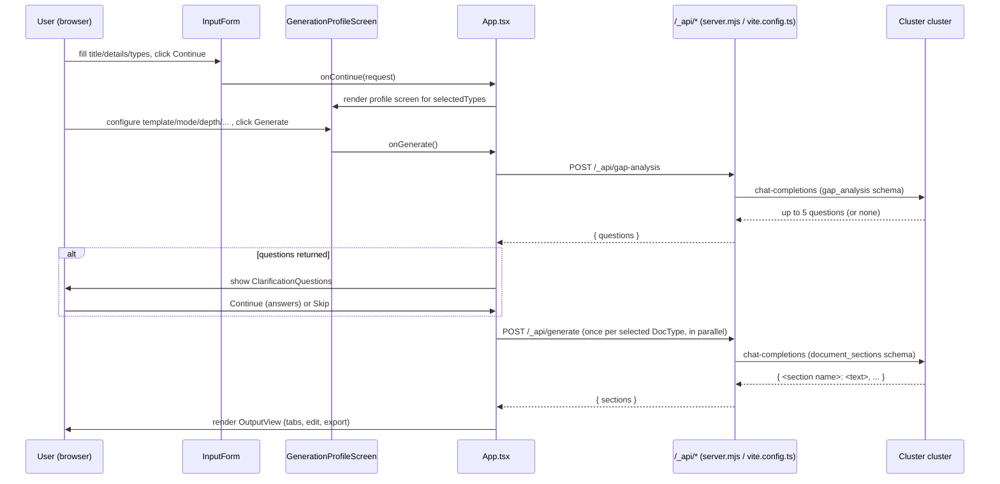
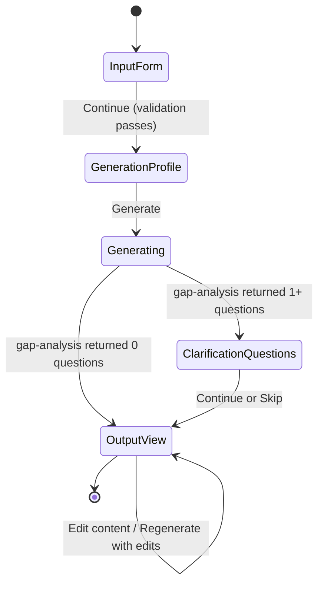

# SpecPilot — Developer Documentation

**Scope of this document:** everything described below is verified directly against the current
source code (paths cited throughout). Nothing here describes planned, roadmap, or deferred work —
where a feature was planned but not built, or built only partially, this is called out explicitly
as a limitation, not presented as working. This document is written for a new developer with no
prior exposure to the codebase.

---

## 1. Executive Summary

**Purpose.** SpecPilot is a web application that generates professional-standard product
documentation — a **Product Requirements Document (PRD)**, a **Technical Requirements
Specification (TRS)**, and/or **UX Design Mockups (UX)** — from a short product description, using
an internal LLM cluster ("Cluster") when available, with a deterministic offline fallback when it
is not.

**Primary use case.** A user (product manager, engineer, or designer) types a product title and a
paragraph of details, picks which of the three document types they need, optionally configures a
detailed generation profile (document format/standard, tone, depth, audience, etc.), and receives
full Markdown documents they can edit inline, regenerate with feedback, and export to Word/PDF/HTML.

**Key capabilities (all confirmed in code):**
- Multi-document generation (PRD/TRS/UX) from one shared input, each independently configurable.
- 9 named document-structure "standards" (e.g. Volere, EARS, C4 Model, Jobs-to-Be-Done) plus a
  Standard default and a user-uploaded Custom template, each per DocType.
- LLM-driven clarifying questions ("gap analysis") before generation.
- Human-in-the-loop editing and "Regenerate with my edits" with per-section keep/rewrite feedback.
- Client-side (`localStorage`) session memory that learns per-DocType preferences over time.
- Reference-document and style-example upload to ground generation in real context.
- Word (`.docx`), PDF, and HTML export.
- A fully deterministic, non-LLM fallback generator so the app never produces nothing.

**High-level architecture.** A single-page React 19 + Vite 7 app (`app/src`) talks only to its own
same-origin Express server (production: `app/server.mjs`) or Vite dev-server plugin (development:
`app/vite.config.ts`) via `/_api/*` routes. That server is a **self-contained Cluster LLM
gateway**: it holds every prompt-construction function, JSON-schema definition, and the
OpenAI-compatible chat-completions client for the internal Cluster cluster, in one file (by
necessity — see §2). There is no separate configured backend microservice in the OAuth-proxy
sense the AGENTS.md template describes; `BACKEND_URL`/OAuth proxying code exists in `server.mjs`
for any *other* `/_api/*` paths but is unused by SpecPilot's own feature set today.

---

## 2. System Architecture

### 2.1 Frontend architecture

- **Entry point:** [app/src/main.tsx](../app/src/main.tsx) mounts `<App />` (from
  [App.tsx](../app/src/App.tsx)) into `#root`, wrapped in `React.StrictMode`.
- **Note on dead code:** `app/src/App-nex.tsx`, `app/src/main-nex.tsx` (referenced in
  `index.html`'s comments/scaffold but not present), and `app/src/routes/ApiExample.tsx` /
  `app/src/routes/Home.tsx` are **not imported anywhere** in `src/` — they are unused scaffold
  leftovers from the original XYZ project template and play no role in the running app.
- `App.tsx` is the single top-level component. It owns almost all cross-cutting state (documents,
  pending/loading, active tab, errors, clarification questions, the two-step flow, the Generation
  Profile value, session-memory write-back) and composes:
  `ThemeProvider` → `AppShell` → `InputForm`, `GenerationProfileScreen`, `ClarificationQuestions`,
  `OutputView`, `ExportControls`.
- **Styling:** a single dark theme (`ThemeProvider.tsx` sets `data-theme="dark"` unconditionally
  on `<html>`) plus a CSS custom-property token sheet (`app/src/theme/tokens.ts`) injected as a
  `<style>` tag. `App.css`/`index.css` hold the rest of the visual styling.
- **HTTP:** all backend calls go through `fetch` directly in `app/src/api/llmClient.ts` (not
  through `app/src/api/client.ts`'s `axios` instance — that file is unused example scaffolding for
  the generic `/_api/health`, `/_api/items` endpoints, which SpecPilot's actual feature set never
  calls).

### 2.2 Backend architecture

Two **independent, manually-synced** copies of the same server-side logic exist:

| File | Used when | Notes |
|---|---|---|
| [app/server.mjs](../app/server.mjs) | Production (Docker image, `npm run build` output) | Self-contained on purpose: the production Docker build (`docker/node20.11/Dockerfile`) only copies `server.mjs` into the runtime image, not the rest of `app/` — so it cannot `import` from any other project file. |
| [app/vite.config.ts](../app/vite.config.ts) | `npm run dev` (Vite dev server) | Implements an internal Vite plugin (`llm-dev`) that registers the same `/_api/*` routes directly against Vite's own dev middleware, duplicating `server.mjs`'s logic line-for-line where behavior must match. |

**There is no shared module between them** — every prompt-guidance constant, schema, and
Calypus-calling function is duplicated. This is a confirmed, intentional (commented) trade-off in
the code, not an oversight, but it is a real maintenance burden: a change to one **must** be
manually mirrored in the other or dev/prod behavior will silently diverge.

Both files implement:
- The `/_api/gap-analysis`, `/_api/generate`, `/_api/template-extract`, `/_api/context-extract`,
  `/_api/llm-status`, `/_api/llm-warmup` routes (§13).
- The full prompt-construction pipeline (`buildGenerateSystemPrompt` and its guidance tables, §6).
- The Cluster HTTP client (`callCluster`/`callClusterChat`, §14).

`server.mjs` additionally implements (present only in production, not relevant to Vite dev):
- `/env-config.js` — serves a runtime-generated env-var script (see AGENTS.md's XYZ template
  pattern); **note:** in `npm run dev`, this route doesn't exist, so the browser gets a **404** on
  every dev-server page load for this script. This is benign (confirmed live) — it doesn't break
  the app — and is unrelated to SpecPilot's own feature work.
- A generic OAuth-token-injecting proxy (`/_api/*` → `BACKEND_URL`) for any path not matched by
  the routes above, and static-file serving of the built `dist/` folder with an SPA catch-all
  (`app.get("*", ...)`). **This proxy/OAuth machinery is not used by any of SpecPilot's own
  features** — every actual feature endpoint is handled locally in-process before the proxy is
  ever reached.

### 2.3 API flow (high level)



### 2.4 State management

All application state lives in **React `useState`** inside `App.tsx` and its children — there is
no Redux/Zustand/Context-based global store beyond `ThemeProvider`'s DOM-attribute side effect.
Cross-component data flows exclusively through props and callback props (`onChange`, `onContinue`,
`onGenerate`, etc.). Persistent state (across page reloads/sessions) exists **only** in
`localStorage`, via the session-memory module (§12) — every other piece of state (current form
values, current documents, current tab) is lost on a full page reload, which was confirmed live:
reloading resets the form and output but leaves session history intact.

### 2.5 Session memory design

See §12 in full. In summary: `app/src/generation/sessionMemory.ts` reads/writes a single
`localStorage` key (`prd-gen:session-memory:v1`) holding up to 20 `SessionRecord`s, and exposes a
recency-weighted "consolidation" vote used to pre-fill the Generation Profile screen's controls
from past choices.

### 2.6 Generation pipeline

See §10 in full. In summary: `App.tsx` → `llmGenService.runGeneration` → one `generateOne()` call
per selected DocType (in parallel, via `Promise.all`) → `llmClient.postGenerate` →
`/_api/generate` → `buildGenerateSystemPrompt` → `callCluster` → response parsed and reconstructed
into a `GeneratedDocument` via `sectionSchema.buildGeneratedDocument`. Any single DocType's failure
falls back to that DocType's deterministic generator (`prdGen.ts`/`trsGen.ts`/`uxGen.ts`) — one
DocType falling back **never** affects the others (each `generateOne` call has its own
independent `try`/`catch`).

### 2.7 Clarification pipeline

See §9 in full. `App.tsx.startGeneration` calls `runGapAnalysis` (which itself never throws — any
failure there is treated as "zero questions") **before** the real generation call. If Cluster
returns 1+ questions, the flow pauses at `ClarificationQuestions`; answering or explicitly
skipping both lead to the same `finishGeneration` call, the only difference being whether
`clarifications` is populated.

### 2.8 Regeneration pipeline

See §11 in full. `OutputView`'s "Regenerate with my edits" button, once confirmed, calls
`App.tsx.onRegenerate(type, priorAttempt)` → `llmGenService.regenerateWithFeedback` → the same
`generateOne` function used for initial generation, but with a `priorAttempt` payload appended to
the user message server-side (`buildPriorAttemptBlock`) — the system prompt itself is unchanged.

### 2.9 History pipeline

See §12.5. `App.tsx.finishGeneration` calls `sessionMemory.appendSessionRecord` exactly once, right
after a successful generation (LLM **or** fallback — it logs the *chosen configuration*, not
whether Cluster was reachable). `App.tsx.onContentChange`/`onSectionThumbsDown` then live-patch
that same, most-recently-appended record's `editedSectionCount`/`thumbsDownSectionCount` fields as
the user interacts with the output. `SessionHistoryPanel` is a pure, read-only view over
`loadSessionMemoryStore()`, re-read every time the `<details>` panel is toggled open.

---

## 3. Folder Structure

```
app/
  server.mjs           Production Express server: Cluster gateway + static file server + OAuth proxy (§2.2)
  vite.config.ts        Dev-mode mirror of server.mjs's /_api/* routes, via a Vite plugin
  index.html             SPA shell; loads /src/main.tsx
  src/
    main.tsx              React root mount (real entry point)
    App.tsx                Top-level state/flow orchestration (§2.4, §4)
    App.css / index.css    Global styles
    api/
      client.ts             Unused axios scaffold (generic /_api/health,/items examples) — dead code for this app's features
      llmClient.ts          The real HTTP client: all postGapAnalysis/postGenerate/postTemplateExtract/postContextExtract/getLlmStatus/triggerLlmWarmup calls
    app/
      AppShell.tsx           Header ("SpecPilot" title + SessionHistoryPanel + HelpPanel) + <main> wrapper
      HelpPanel.tsx          Static collapsible help text
    export/
      exportService.ts       buildWord/buildPdf/buildMockup/buildExport — pure functions producing a Blob
    features/
      input/
        InputForm.tsx            Screen 1: title/details/doc-types/guided questions
        ClarificationQuestions.tsx  Renders up to 5 LLM-authored follow-up questions
      profile/
        GenerationProfileScreen.tsx  Screen 2: the entire Generation Profile UI (§6)
      output/
        OutputView.tsx            Tabbed Markdown editor/preview + regenerate flow (§11)
      export/
        ExportControls.tsx        "Export Word"/"Export PDF"/"Download UX" buttons
      history/
        SessionHistoryPanel.tsx   "Your generation history" collapsible panel (§12.6)
    generation/
      contract.ts             All shared types/constants/enums — the single source of truth for every dropdown's possible values (§6)
      validate.ts             InputForm's client-side required-field validation
      sectionSchema.ts         Per-format section-name lists + document (re)construction
      naming.ts                Export filename builder
      prdGen.ts / trsGen.ts / uxGen.ts   Deterministic (non-LLM) fallback generators, one per DocType
      genService.ts            Pure, synchronous orchestration of the 3 deterministic generators (only used directly by its own tests — the live app path goes through llmGenService)
      llmGenService.ts         The real generation orchestrator: gap-analysis, per-DocType generate/regenerate, LLM-vs-fallback branching
      sessionMemory.ts         localStorage-backed session history + preference consolidation (§12)
    theme/
      ThemeProvider.tsx        Forces dark theme
      tokens.ts                CSS custom-property definitions
    routes/
      ApiExample.tsx, Home.tsx   Unused scaffold — not imported anywhere
  tests/                     Vitest suite (§16) — mirrors the src/ structure above
docs/                      Planning/analysis markdown (not shipped code) — the actual historical
                             requirements documents this codebase was built against
deployment/                 Helm values for the `ee` (dev/sbx) environments
docker/                     Dockerfile + entrypoint script that generates /tmp/env-config.js at
                             container start from environment variables
```

---

## 4. Application Flow



- **InputForm → GenerationProfileScreen**: entry condition is simply rendering (InputForm is
  always mounted). Exit condition: clicking **Continue** with `productTitle`, `productDetails`
  non-empty and at least one `selectedTypes` entry (enforced by `validate()`, §5). On success,
  `App.onContinue` stores the request as `draftRequest` and sets `step = "profile"`, which
  conditionally renders `GenerationProfileScreen` **below** the still-visible `InputForm` (the
  form is never unmounted — both are visible at once at this point, confirmed in
  `App.tsx`'s JSX).
- **GenerationProfileScreen → (Clarifications | OutputView)**: entry condition is `step ===
  "profile" && draftRequest` truthy. Exit: clicking **Generate** calls `App.onProfileGenerate`,
  which immediately sets `step` back to `"input"` (hiding the profile screen) and calls
  `startGeneration(draftRequest)`. Data passed forward: the full `GenerationProfileScreenValue`
  (profile + outputStructureItems + referenceContent + usePriorPreferences) was already being
  captured live in `profileValue` state via the screen's `onChange` callback on every field
  change, so nothing needs to be re-read at this point.
- **Clarifications**: entry condition is `runGapAnalysis` returning ≥1 question. Exit: **Continue**
  (with whatever text was typed, defaulting to `""` per-question) or **Skip** (empty answers
  object) — both call `finishGeneration(pendingRequest, clarifications)`, so the only difference
  is the content of `clarifications`.
- **OutputView**: entry condition is `documents.length > 0`. From here, editing a tab's textarea
  and clicking **Regenerate with my edits** re-enters a "pending" sub-state per DocType (see §11)
  but never leaves `OutputView` itself — there is no separate "regenerating" screen.
- **Session History** is not a step in this flow — it's an always-available collapsible panel in
  the header (`AppShell`), independent of the current `step`.

---

## 5. Input Form Documentation

File: [app/src/features/input/InputForm.tsx](../app/src/features/input/InputForm.tsx). Validation:
[app/src/generation/validate.ts](../app/src/generation/validate.ts).

| Field | Label | Purpose | Required? | Validation | Impact on generation | Backend payload field |
|---|---|---|---|---|---|---|
| `productTitle` | "Product Title" | Short product name, used verbatim in every generated document's title/heading | Yes | Non-empty after `.trim()`, else `"Product Title is required."` | Interpolated directly into every prompt (`productTitle`) and into export filenames (`naming.ts`) | `productTitle` |
| `productDetails` | "Product Details" | Free-text product description — the core substance the model works from | Yes | Non-empty after `.trim()`, else `"Product Details are required."` | Sent verbatim as part of the user message JSON to gap-analysis and generate | `productDetails` |
| `selectedTypes` | "Document types" (PRD/TRS/UX checkboxes) | Which document(s) to generate | At least 1 | Empty selection → `"Select at least one document type."` | Determines which DocTypes even get a `generateOne()` call, and which per-DocType Generation Profile sub-panels render | `selectedTypes` (array) |
| Guided questions (8 total, filtered to only the selected DocTypes' questions) | e.g. "Who are the primary target users of this product?" | Optional extra structured hints per DocType | No — always optional | None | Sent as `answers[<question id>]`, included verbatim in the user-message JSON for gap-analysis/generate | `answers: Record<string, string>` |

**Guided question set (hard-coded in `InputForm.tsx`, not user-configurable):**
- PRD: `prd_target_users`, `prd_constraints`, `prd_success_metric`
- TRS: `trs_integrations`, `trs_data_sensitivity`, `trs_deployment`
- UX: `ux_journey`, `ux_platform`

Only the questions belonging to a currently-checked DocType are rendered (`visibleQuestions`
filter) — unchecking a DocType hides (but does not clear) its answers from view; the state itself
is retained in `answers` regardless (unmounting doesn't reset the object), though an unselected
DocType's answers are never actually sent anywhere since `selectedTypes` no longer includes it.

**Continue button**: disabled and relabeled `"Continuing…"` whenever `pending` is true (i.e. any
generation-related async call is in flight anywhere in the app — `pending` is a single shared
boolean owned by `App.tsx`, not scoped to InputForm alone).

---

## 6. Generation Profile Documentation

File: [app/src/features/profile/GenerationProfileScreen.tsx](../app/src/features/profile/GenerationProfileScreen.tsx).
Types/constants: [app/src/generation/contract.ts](../app/src/generation/contract.ts). Prompt
construction: `buildGenerateSystemPrompt` in `app/vite.config.ts`/`app/server.mjs` (identical).

Every control in this section (except Traceability/Assumption Strategy/Compliance
Framing/Context Sources, which are shared across all selected DocTypes) is **repeated once per
selected DocType**, each independently configurable.

### 6.1 Template (format)

- **UI control:** radiogroup, `aria-label="${docType} Template"`.
- **Values:** `FORMAT_APPLICABILITY[docType]` — 5 options per DocType: `standard` + 3 named
  formats + `custom`.
  - PRD: Standard, `volere`, `pr_faq`, `shape_up`, Custom
  - TRS: Standard, `ears`, `formal_srs`, `c4_model`, Custom
  - UX: Standard, `service_blueprint`, `jtbd`, `atomic_design`, Custom
- **Default:** `"standard"` for every DocType (or a `localStorage`-derived value if session
  history exists and `"Use my prior preferences"` is on — see §6.11).
- **Purpose:** selects both the section/heading skeleton (`sectionNamesFor`, §7) **and** a
  dedicated prompt-guidance paragraph (`FORMAT_GUIDANCE[format]`) injected into the system prompt.
- **Backend payload field:** `format` (+ `sections: string[]`, computed client-side from
  `sectionNamesFor(docType, format, customSections, additionalSections)` before the request is
  even sent).
- **Impact on output:** confirmed live — selecting Custom and uploading a 3-section template
  produced a generated PRD using exactly those 3 headings, in that order.
- **Special case — `ears` (TRS only):** does **not** change the section skeleton (`sectionNamesFor`
  has no `"ears"` branch, so it silently reuses standard TRS sections). Instead,
  `llmGenService.generateOne` sets `requirementPhrasing: "ears"` whenever `format === "ears"`,
  which server-side appends `EARS_GUIDANCE` (a distinct block instructing 6 specific EARS sentence
  patterns) — a phrasing overlay on top of the standard structure, by design.
- **Custom:** selecting it reveals a file `<input type="file" accept=".txt,.md,.docx">`
  (`${docType} custom template upload`). On file selection,
  `handleCustomTemplateUpload(docType, file)` reads the file (client-side `.text()`, or
  `mammoth.extractRawText` for `.docx`), POSTs to `/_api/template-extract`, and stores the
  returned `sections: string[]` in `perDocType[docType].customTemplateSections`. A confirmation
  paragraph `"Extracted sections: <comma-separated list>"` renders once this succeeds. On failure,
  shows `"Couldn't read your template - try again or use a Standard format."`. **This upload is
  fully independent per DocType** — selecting PRD=Custom and TRS=Custom lets you upload two
  completely different template files, each stored and labeled separately.
- **Hover/focus format preview:** hovering or keyboard-focusing any of the 9 named-format radio
  options (not Standard, not Custom) reveals a static, hand-authored worked example directly below
  the radiogroup — a one-line description of what makes that format distinct plus a short Markdown
  snippet using the format's real section names and writing style (e.g. Volere's Fit Criteria,
  EARS's six sentence patterns, C4's four architecture zoom levels). Source data:
  `app/src/generation/formatExamples.ts`'s `FORMAT_EXAMPLES` (keyed by `DocType` then
  `DocumentFormatId`). These are **static illustrative examples only** — no LLM call is made, and
  they use a fixed example product ("Acme Widget") rather than the user's actual product details,
  so they should be read as "what this format's style/structure looks like," not a preview of what
  *your* document will actually say.

### 6.2 Generation Mode

- **UI control:** radiogroup, `aria-label="${docType} Generation Mode"` — actually rendered under
  a legend but note: labels use `GENERATION_MODES[docType]`'s raw values.
- **Values:** `GENERATION_MODES` in `contract.ts`:
  - PRD: `customer_value`, `product_management`, `engineering_handoff`, `executive_summary`
  - TRS: `strict_trs`, `functional_decomposition`, `implementation_oriented`, `verification_oriented`
  - UX: `user_journey`, `wireframe_generation`, `interaction_design`, `accessibility_focus`, `research_discovery`
- **Default:** PRD → `product_management`, TRS → `strict_trs`, UX → `user_journey` (each is
  documented in-code as "the default, standard-format tone" — chosen so leaving this control
  untouched reproduces the exact pre-Generation-Profile-screen prompt behavior).
- **Purpose:** a per-DocType "lens" replacing a generic Tone control — e.g. TRS
  `verification_oriented` adds "For every requirement, explicitly state how it would be verified".
- **Backend payload field:** `generationMode`.
- **Where used:** `GENERATION_MODE_GUIDANCE[docType][generationMode]`, injected right after
  Format/EARS guidance in the prompt-assembly order.

### 6.3 Requirement Depth

- **UI control:** radiogroup, values from `REQUIREMENT_DEPTH_LEVELS`: `high_level`,
  `standard_engineering`, `detailed_engineering`, `compliance_grade`.
- **Default:** `standard_engineering` (its guidance string is literally `""` — an intentional
  no-op matching prior behavior).
- **Purpose:** controls how much rationale/edge-case/verification detail accompanies each
  requirement. `compliance_grade` adds "explicit rationale, edge-case handling, and a
  verification/traceability note — sufficient detail to support a compliance or safety-case
  review."
- **Backend payload field:** `requirementDepth`.

### 6.4 Requirement Decomposition

- **UI control:** radiogroup, values from `REQUIREMENT_DECOMPOSITION_LEVELS`: `feature`,
  `functional_requirement`, `sub_system`, `component`, `signal_interface`.
- **Default:** `functional_requirement` (also an intentional no-op `""` guidance string).
- **Purpose:** controls the granularity at which requirements are phrased (whole features vs.
  down to individual signal/interface level).
- **Backend payload field:** `requirementDecomposition`.

### 6.5 Innovation Assistance

- **UI control:** radiogroup, values from `INNOVATION_ASSISTANCE_LEVELS`: `disabled`,
  `suggest_missing`, `challenge_assumptions`, `explore_alternatives`, `maximum_ideation`.
- **Default:** `disabled`.
- **Purpose/actual effect — verified in code (`INNOVATION_ASSISTANCE` map in `server.mjs`):** each
  level pairs **both** a distinct prompt instruction **and** a distinct Cluster
  `temperature` value:

  | Level | Temperature | Guidance summary |
  |---|---|---|
  | `disabled` | 0.2 | Do not propose anything beyond what's stated/implied. |
  | `suggest_missing` | 0.4 | Explicitly propose requirements believed missing, labeled as suggestions. |
  | `challenge_assumptions` | 0.6 | Question stated/implied assumptions, propose alternatives. |
  | `explore_alternatives` | 0.8 | Propose at least one clearly-labeled alternative approach. |
  | `maximum_ideation` | 1.0 | Maximally exploratory; liberal novel ideas, clearly labeled as ideation. |

  **Accuracy note (fixed):** the `INNOVATION_ASSISTANCE` map's code comment previously (and
  incorrectly) claimed temperature wasn't wired in yet — this has been corrected; `handleGenerate`
  does compute `temperature` from `innovationAssistance` and pass it into `callCluster`. (It is
  **not** applied to `/_api/gap-analysis` or `/_api/template-extract`, which never pass a
  `temperature` argument at all.)
  **Grounding safeguard:** since a raised temperature affects the model's writing throughout the
  *entire* response, not just the specifically-labeled suggestion/challenge/ideation additions,
  every level above `disabled` now also appends an explicit instruction (`INNOVATION_GROUNDING_
  GUIDANCE`) telling the model to keep all directly-requested, input-grounded content strictly
  grounded regardless of the creativity setting, and to confine any added speculation strictly to
  what's already labeled as such. This is a mitigation, not a guarantee — review output at higher
  Innovation Assistance levels carefully regardless.
- **Backend payload field:** `innovationAssistance`.

### 6.6 Target Audience

- **UI control:** radiogroup, values from `TARGET_AUDIENCES`: `engineering`, `product`,
  `customer`, `management`.
- **Default:** PRD → `product`, TRS → `engineering`, UX → `product` (each DocType's own
  documented default audience).
- **Purpose:** adjusts vocabulary/depth for the intended reader, e.g. TRS `customer` → "plain,
  non-technical language ... minimizing internal engineering terminology."
- **Backend payload field:** `targetAudience`. Guidance source: `TARGET_AUDIENCE_GUIDANCE[docType][targetAudience]` (each DocType's default-matching value is an intentional empty string).

### 6.7 Assumption Strategy

- **UI control:** radiogroup (shared once for all DocTypes, not per-DocType), values from
  `ASSUMPTION_STRATEGIES`: `strict`, `balanced`, `exploratory`.
- **Default:** `balanced` (empty guidance string — matches prior implicit behavior).
- **Purpose:** how the model should handle gaps in the input. `strict` forbids inventing anything
  not present, instructing an explicit Open Issue/Assumption instead; `exploratory` instructs
  proactively proposing a plausible option instead of flagging a gap.
- **Backend payload field:** `assumptionStrategy` (top-level, not per-DocType).

### 6.8 Compliance Framing

- **UI control:** two independent checkboxes (shared, not per-DocType): "ASPICE", "ISO 26262".
- **Default:** both unchecked.
- **Purpose:** ASPICE → "frame requirements using ASPICE work-product-aware language... without
  claiming this document literally is an ASPICE work product." ISO 26262 → "explicitly flag any
  requirement that appears safety-relevant... as such." Deliberately **not** part of
  `FORMAT_GUIDANCE` — these are process/compliance standards, not document templates, per its own
  code comment.
- **Backend payload field:** `complianceFraming: { aspice?: boolean; iso26262?: boolean }`.

### 6.9 Traceability

- **UI control:** three checkboxes (shared, not per-DocType): "Generate requirement IDs", "CRS →
  TRS mapping", "Verification references".
- **Default:** all unchecked.
- **Purpose/actual behavior:**
  - `generateIds` → PRD gets guidance to assign each Functional Requirement a stable
    `CRS-<NNN>` ID; TRS gets guidance to assign each requirement a `TRS-<NNN>` ID.
  - `requirementMapping` (**only takes effect if `generateIds` is also checked** — it's nested
    inside that `if` in `buildGenerateSystemPrompt`) → TRS gets guidance to reference the CRS-ID(s)
    each requirement fulfills. The UI now disables this checkbox (with an explanatory tooltip)
    whenever "Generate requirement IDs" is unchecked, so it can no longer be checked while inert.
  - `verificationReferences` (**also nested under `generateIds`**) → TRS's Test and Validation
    section gets guidance to reference the requirement IDs each test verifies. Same UI disabling
    applies.
  - **UX has no traceability guidance at all** — `TRACEABILITY_ID_GUIDANCE`/`_MAPPING_GUIDANCE`/
    `_VERIFICATION_GUIDANCE` have no `UX` key. The whole Traceability fieldset is now hidden
    entirely whenever neither PRD nor TRS is among `selectedTypes`, so it can no longer be shown
    with zero effect for a UX-only batch.
- **Backend payload field:** `traceability: { generateIds, requirementMapping, verificationReferences }` (top-level, not per-DocType).
- **Known limitation:** IDs are **not stable across regenerations** — there is no persisted ID
  registry; each generation call independently asks the model to invent IDs following the naming
  convention, with no guarantee of consistency between calls. (Confirmed by the absence of any
  ID-storage code anywhere in `sessionMemory.ts` or elsewhere.)

### 6.10 Output Structure

- **UI control:** checkboxes, one set per DocType, filtered to items applicable to that DocType.
- **Values (`OUTPUT_STRUCTURE_ITEMS`):** User Stories, Acceptance Criteria, Risks, Dependencies,
  Open Questions, Wireframe Suggestions, Edge Cases, Validation Criteria.
- **Applicability (`OUTPUT_STRUCTURE_APPLICABILITY`):**

  | Item | Applies to |
  |---|---|
  | User Stories | PRD, UX |
  | Acceptance Criteria | PRD, TRS |
  | Risks | PRD, TRS, UX |
  | Dependencies | PRD, TRS |
  | Open Questions | PRD, TRS |
  | Wireframe Suggestions | PRD, TRS |
  | Edge Cases | PRD, TRS |
  | Validation Criteria | TRS |

- **Default:** all unchecked.
- **Deduplication logic (confirmed live and in code):** each checkbox is `disabled` (with a
  `title` tooltip: `Already included as "<name>" in the selected Template`) whenever
  `OUTPUT_STRUCTURE_EQUIVALENTS[item]` contains a section name already present in
  `sectionNamesFor(docType, current.format, current.customTemplateSections)` — i.e. this
  re-evaluates every time the Template selection or custom-template upload changes. Confirmed
  live across 3 states: Standard PRD (Risks+Dependencies disabled, matched by "Risks and
  Dependencies"), Volere PRD (Risks disabled matched by "Risks", Open Questions disabled matched
  by "Open Issues", but Dependencies becomes enabled since Volere has no such section), Custom PRD
  (dedup re-evaluated against the uploaded template's own sections).
- **Backend payload field:** checked items become `additionalSections` passed into
  `sectionNamesFor(...)` client-side (so they become genuinely new `##` sections in the requested
  document, appended after the format's base sections, deduped against any already present) —
  **and** any item applicable to that docType is also turned into prompt guidance
  (`OUTPUT_STRUCTURE_GUIDANCE[item]`) server-side, e.g. "User Stories" → 'Phrase as "As a <role>, I
  want <goal>, so that <benefit>"'.

### 6.11 Context Sources

See full detail in §8 (Reference Document System). Summary of controls, all **shared across every
selected DocType** (rendered once, not per-DocType):
- **"Use uploaded reference documents"** checkbox (default unchecked) — reveals the reference-doc
  upload control when checked.
- **"Use my prior preferences (this browser)"** checkbox (default **checked**) — a `usePriorPreferences`
  boolean returned via `onChange`; the screen's *own* initial values are always pre-filled from
  session memory on mount regardless of this checkbox's value. Unchecking it opts **this
  generation's own session record** out of being written to `localStorage`
  (`App.tsx`'s `finishGeneration` skips `appendSessionRecord` when
  `profileValue?.usePriorPreferences === false`) — i.e. it excludes an atypical/one-off
  generation from influencing future pre-fill/consolidation, without affecting this screen's own
  initial values.
- **"Include web search results"** checkbox — permanently `disabled`, permanently unchecked,
  `readOnly`, with tooltip "Requires an approved web search provider - not yet available". This is
  a deliberate visual placeholder, not a bug — no web-search capability exists anywhere in the
  codebase.
- **Reference documents** upload (only visible when the first checkbox above is checked) —
  `.txt/.md/.docx/.pdf`, one file per upload, appended to a shared array capped at the most recent
  3 (`.slice(-3)`).
- **Style example** upload — always visible (independent of the reference-documents checkbox),
  single file, `.txt/.md/.docx/.pdf`.

### 6.12 Session-memory pre-fill and conflict indicators

On mount, every per-DocType field above (except Traceability's individual sub-fields, which are
shared/top-level) is pre-filled via `consolidatePerDocTypeField`/`consolidateAssumptionStrategy`/
`consolidateTraceabilityFlag` (§12.4) reading from `localStorage`. If the consolidated "winning"
value's confidence is below 60% or within 15 points of the runner-up, a small info line ("Your
past choices for this were mixed - showing our best guess.") renders beside that field — the value
itself is still applied either way; this is purely a transparency cue, never a blocker.

### 6.13 Generate button

Disabled and relabeled `"Generating…"` whenever `pending` is true (same shared boolean as
InputForm's Continue button).

---

## 7. Custom Template System

**Files:** `GenerationProfileScreen.tsx` (upload UI/state), `sectionSchema.ts` (`sectionNamesFor`),
`llmClient.ts` (`postTemplateExtract`), `server.mjs`/`vite.config.ts` (`handleTemplateExtract`).

- **Upload flow:** selecting "Custom" as a DocType's Template reveals a single-file
  `<input type="file" accept=".txt,.md,.docx">`. On change,
  `handleCustomTemplateUpload(docType, file)` runs.
- **Extraction flow:** `readFileAsText(file)` — for `.docx`, uses `mammoth.extractRawText`
  client-side (no server round-trip, no Cluster token spend for this step); for `.txt`/`.md`, uses
  `File.text()`. The resulting raw text is then POSTed to `/_api/template-extract` as
  `{ docType, rawText }`.
- **Section extraction behavior (server-side):** a small, purpose-built system prompt ("Extract an
  ordered list of section/heading names from this requirements/product template. Return only
  section names, no content, no numbering.") is sent to Cluster with a strict JSON schema
  (`{ sections: string[] }`). **There is no deterministic fallback for this endpoint** — if
  Cluster is unreachable, `/_api/template-extract` returns `503 { error: "LLM_UNAVAILABLE" }` and
  the UI shows `"Couldn't read your template - try again or use a Standard format."`.
- **Deduplication logic:** none at the template-extraction step itself — the extracted section
  list is stored as-is. Deduplication only happens later, in the Output Structure checkboxes
  (§6.10), against whatever `sectionNamesFor` returns for the now-custom format.
- **Template influence on generation:** `sectionNamesFor(docType, "custom", customTemplateSections)`
  returns `customTemplateSections` verbatim as the section list — these become both (a) the exact
  `sections` array requested from the model via `/_api/generate`, using a strict JSON schema keyed
  by those names, and (b) the reconstructed document's `##` headings
  (`buildGeneratedDocument`). Additionally, `FORMAT_GUIDANCE.custom` is injected: "Follow the exact
  section list provided for this document - infer the appropriate content style and depth from
  the section names themselves, since no other guidance is available for a user-provided
  template."
- **Per-DocType isolation:** confirmed — this entire flow is rendered inside the per-DocType loop
  in `GenerationProfileScreen.tsx`, storing state in `perDocType[docType].customTemplateSections`.
  Selecting a different DocType's Custom Template uploads an entirely independent file with no
  shared state.
- **Known limitations:**
  - One file at a time per DocType; a new upload **replaces** (does not merge with) the previous
    extraction for that DocType.
  - No `.pdf` support for templates (only `.txt`/`.md`/`.docx`).
  - Custom's own extracted sections still have no preview beyond the post-upload confirmation
    text (a preview only makes sense once a file has actually been uploaded and extracted). The 9
    **named** formats, however, now have a hover/focus preview — see the note at the end of §6.1.
  - Extraction quality depends entirely on the model's interpretation of the uploaded document; no
    validation exists that the extracted list is sensible (e.g. it could return an empty array or
    duplicate names, which would flow straight into the generate schema unmodified).

---

## 8. Reference Document System

**Files:** `GenerationProfileScreen.tsx` (upload UI/state), `llmClient.ts`
(`postContextExtract`/`postContextExtractBinary`), `server.mjs`/`vite.config.ts`
(`handleContextExtract`, `extractPdfViaMultimodal`).

- **Supported file types:** `.txt`, `.md`, `.docx`, `.pdf` — for both the "reference documents"
  and "style example" upload controls.
- **Upload workflow:** checking "Use uploaded reference documents" reveals its file input. Both
  this input and the always-visible "Style example" input call `extractTextFromUpload(file)`,
  which branches on file extension.
- **Extraction workflow:**
  - `.pdf` → `fileToBase64(file)` (client-side, plain `btoa` over the raw bytes) →
    `postContextExtractBinary(filename, base64Content)` → `/_api/context-extract` with
    `{ base64Content }` → server calls `extractPdfViaMultimodal(base64Content)`.
  - `.docx` → `mammoth.extractRawText` client-side → plain text.
  - `.txt`/`.md` → `File.text()` client-side → plain text.
  - For non-PDF cases, the extracted/raw text is then POSTed to `/_api/context-extract` as
    `{ filename, rawText }` — this path makes **no Cluster call at all**; the server only enforces
    a character budget (`CONTEXT_EXTRACT_CHAR_LIMIT`, default 8000 chars **per document**) and
    returns `{ extractedText, truncated }`.
- **PDF handling in detail:** `.pdf` uploads are base64-encoded and sent as an OpenAI-style
  `image_url` content block (`data:application/pdf;base64,<...>`) in a chat-completions call to
  the `vllm-qwen36-35b-a3b` Cluster candidate, using a strict JSON schema
  (`{ extractedText: string }`), max 8192 tokens. **This is explicitly marked `UNVERIFIED` in the
  code's own comment**: there is no documented request/response contract for sending a PDF this
  way to this specific deployment, and the code comment states a real PDF upload is needed to
  confirm the deployment actually accepts this format. A prior test with a minimal hand-crafted
  PDF returned `200 OK` with an **empty** `extractedText`.
- **DOCX handling:** entirely client-side via the `mammoth` npm package (no official TypeScript
  types exist for it — `app/src/mammoth.d.ts` provides a minimal ambient declaration). No server
  round-trip, no Cluster token spend.
- **Context injection process:** on the client, extracted text is appended to a shared
  `referenceDocuments: string[]` array (capped at the most recent 3 via `.slice(-3)`) or stored as
  the single `styleExample` string. Both are bundled into one `referenceContent` object
  (`{ documents?, styleExample? }`) in the `GenerationProfileScreenValue` emitted on every change,
  and passed through unmodified for **every** selected DocType's `/_api/generate` call (confirmed
  in `llmGenService.generateOne` — the exact same `input.referenceContent` object is used
  regardless of `docType`). **This is a shared, non-per-DocType pool** — there is no way to scope
  a reference document to only one selected DocType.
- **How extracted content enters prompts:** `buildReferenceContentBlock(referenceContent)`
  server-side builds up to two prompt-appended blocks:
  - Documents: joined with `\n---\n`, framed as "reference documents provided for background
    context only ... do not copy their content verbatim or treat them as more authoritative than
    the product title/details above."
  - Style example: framed as "an example of a previously generated document of the same type,
    provided only as a style/structure reference - do not copy its specific content, only its tone
    and level of detail."
- **Failure behavior:** any extraction failure (thrown exception anywhere in
  `extractTextFromUpload`) is caught and shown as `"Couldn't read <filename> - try again."` via a
  shared `contextError` alert. **PDF-specific failure**: if Cluster itself is unreachable during
  PDF extraction, `/_api/context-extract` returns `503 { error: "LLM_UNAVAILABLE" }` — this is the
  one context-extract failure mode that is a genuine "LLM down" condition rather than a client bug,
  per the code's own comment.
- **Known limitations:**
  - Reference documents show a confirmation listing a short preview of each of the (up to 3)
    uploaded documents ("N of 3 reference documents added: ..."), and the style example shows
    "Style example added: ..." — both now mirror the Custom Template upload's confirmation
    pattern. There is still no confirmation of the *server-side* extraction quality itself (e.g.
    whether a `.pdf` genuinely extracted meaningful text vs. an empty string) beyond the preview
    text shown, which will simply look empty/very short if extraction produced little content.
  - Maximum of 3 reference documents, uploaded one at a time (no `multiple` file-picker support).
  - Per-document character limit of 8000 (configurable via `CONTEXT_EXTRACT_CHAR_LIMIT`); no
    client-side warning is shown when a document gets silently truncated beyond `truncated: true`
    in the response (and nothing in `GenerationProfileScreen.tsx` currently surfaces that flag to
    the user at all — it's read in the response type but not rendered anywhere).
  - PDF extraction quality is unverified against real-world PDFs (see above).

---

## 9. Clarification Question System

**Files:** `llmGenService.ts` (`runGapAnalysis`), `llmClient.ts` (`postGapAnalysis`),
`ClarificationQuestions.tsx`, `App.tsx` (orchestration), `server.mjs`/`vite.config.ts`
(`handleGapAnalysis`, `GAP_ANALYSIS_SYSTEM_PROMPT`, `gapAnalysisSchema`).

- **Trigger:** every call to `startGeneration` (i.e. every click of the Generation Profile
  screen's Generate button) unconditionally calls `runGapAnalysis` first, **before** any actual
  document generation happens.
- **Generation process:** `runGapAnalysis` POSTs `{ productTitle, productDetails, selectedTypes,
  answers }` to `/_api/gap-analysis`. Server-side, a single Cluster chat-completions call is made
  with a system prompt instructing the model to identify up to 5 gaps that would prevent writing
  testable requirements/personas/NFRs, using a strict JSON schema capping the array at 5 items. If
  the input is already sufficient, the model is explicitly instructed to return an empty list.
- **Skip behavior:** `ClarificationQuestions`' "Skip" button calls `onSkip` → `App.onClarificationsSkip`
  → `finishGeneration(pendingRequest, {})` — i.e. generation proceeds with an **empty**
  `clarifications` object, not with any auto-filled defaults.
- **Answer behavior:** each question's `<input>` is a plain controlled text field keyed by the
  question's `id`; unanswered questions simply never get a key in the `answers` object passed to
  `onSubmit`. There is no requirement to answer all (or any) questions before clicking Continue.
- **Backend flow:** whatever `clarifications` object results (from Continue or Skip) is passed
  into `finishGeneration` → `runGeneration` → each `generateOne` call's `postGenerate` request as
  the `clarifications` field, which becomes part of the raw JSON blob in the user message (not the
  system prompt) sent to the model during the *real* generate call — **the gap-analysis questions
  and answers are never re-validated or re-checked; they're simply additional free-text context.**
- **Prompt effects:** none on the *system* prompt (`buildGenerateSystemPrompt` never reads
  `clarifications`) — it only affects the **user message** content
  (`JSON.stringify({ productTitle, productDetails, answers, clarifications, sections, ... })`).
- **Failure behavior (important):** `runGapAnalysis` has a bare `catch { return [] }` — **any**
  failure (Cluster down, network error, malformed response) is silently treated as "zero
  questions", and the flow proceeds straight to `finishGeneration` with no user-visible error and
  no distinction from the "nothing to ask" case. This was a deliberate design choice per its own
  code comment ("Gap analysis is a nice-to-have... never blocks generation").

---

## 10. Document Generation Pipeline

**End-to-end, from `App.onProfileGenerate` to rendered `OutputView`:**

1. **Input collection:** `draftRequest` (from InputForm) + `profileValue` (from
   GenerationProfileScreen, already live-updated via its `onChange` prop on every field change) are
   both already sitting in `App.tsx` state by the time Generate is clicked.
2. **Gap analysis** (§9) — may pause the flow for clarifications.
3. **`finishGeneration(request, clarifications)`** builds one `LlmRequestInput` object bundling
   `productTitle`, `productDetails`, `selectedTypes`, `answers`, `clarifications`,
   `profile: profileValue.profile`, `outputStructureItems`, `referenceContent`.
4. **`runGeneration(input)`** calls `generateOne(docType, input)` **once per selected DocType, all
   in parallel** via `Promise.all` — a slow or failing DocType never blocks/affects another.
5. **Per-DocType prompt/context assembly** (`generateOne`):
   - Reads that DocType's slice of the profile (`perDocType[docType]`).
   - Computes the full `sections` array via `sectionNamesFor(docType, format, customSections,
     additionalSections)`.
   - Computes `requirementPhrasing: "ears"` if `format === "ears"`, else `undefined`.
   - Calls `postGenerate` with every field described in §6, plus `referenceContent` and (if this is
     a regeneration) `priorAttempt`.
6. **LLM invocation (server-side):** `buildGenerateSystemPrompt(...)` assembles the full system
   prompt in this exact order (confirmed in code):
   base instruction → `DOC_TYPE_GUIDANCE` → `FORMAT_GUIDANCE` → EARS (if applicable) →
   `GENERATION_MODE_GUIDANCE` → Target Audience → Requirement Depth → Requirement Decomposition →
   Traceability (if `generateIds` enabled) → Assumption Strategy → Compliance Framing (if any
   checked) → Output Structure guidance (filtered to applicable items) → reference-content block →
   Innovation Assistance guidance → a closing formatting instruction (clean Markdown, no invented
   sections, be specific, never repeat the caller-added `##` heading).
   The user message is `JSON.stringify({ productTitle, productDetails, answers, clarifications,
   sections, priorAttemptContext? })`.
   `callCluster(messages, generateSchema(sections), Cluster_GENERATE_MAX_TOKENS, temperature)` then:
   - Checks every configured candidate model's live `/cmd/state` (in parallel); any `ONLINE`
     candidate is raced via `Promise.any` (first success wins); any `STOP` candidate is
     fire-and-forget triggered to start (for next time, not this request).
   - Each candidate attempt itself first tries a structured `response_format` JSON-schema call
     (bounded by `Cluster_STRUCTURED_ATTEMPT_TIMEOUT_MS`, default 20s); on failure, retries once
     with a plain-JSON instruction appended as a `user` message (bounded by
     `Cluster_CHAT_TIMEOUT_MS`, default 90s).
   - The whole race is bounded by `Cluster_TOTAL_TIMEOUT_MS` (default 115s) as a final safety net.
   - If **no** candidate is `ONLINE`, or all racing candidates fail, or the race times out, a
     `LlmUnavailableError` propagates up.
7. **Response handling:** on success, `generateSchema(sections)`'s strict JSON schema guarantees
   the response is `{ <exact section name>: <string>, ... }` for every requested section; the
   server wraps it as `{ sections: result }` to match the client's `GenerateResponse` contract.
8. **Output formatting (client):** `buildGeneratedDocument(productTitle, docType, response.sections,
   format, customSections, additionalSections)` reconstructs the full Markdown document: a top
   `#` title, then one `## <n>. <section name>` heading per section (PRD/TRS) or `## <section
   name>` (UX, no numbering), each followed by that section's returned text. The result is tagged
   `source: "llm"`.
9. **Fallback path:** if **any** step in 5–8 throws (network error, Cluster unavailable, schema
   violation, etc.), `generateOne`'s outer `try/catch` swallows it and instead calls
   `buildDeterministic(docType, input)` — the fully offline, template-string generator
   (`prdGen.ts`/`trsGen.ts`/`uxGen.ts`) using only `productTitle`/`productDetails`/`selectedTypes`
   (none of the Generation Profile fields apply to the fallback at all), tagged `source:
   "fallback"`.
10. **Rendering:** `App.tsx` stores the resulting `GeneratedDocument[]` and displays them in
    `OutputView`; if the *active* tab's document is a fallback, a visible banner reads "Generated
    using the offline fallback (AI service unavailable)."; a session record is appended to
    `localStorage` regardless of source (§12.5).

---

## 11. Human Feedback & Regeneration System

**File:** [app/src/features/output/OutputView.tsx](../app/src/features/output/OutputView.tsx),
orchestrated by `App.tsx`.

- **Edit detection:** `hasEdit = value !== activeDoc.content`, where `value` is the current tab's
  live-edited textarea content (`edits[activeDoc.type] ?? activeDoc.content`). The "Regenerate
  with my edits" button only renders when `hasEdit` is true.
- **Every keystroke** in the textarea calls `onEdit` → `setEdits` (local component state) **and**
  `onContentChange?.(activeDoc.type, content)` → `App.onContentChange`, which recomputes
  `countEditedSections(original, content)` (a naive positional diff over `\n(?=## )`-split
  sections — see §6/§12 for its exact behavior) and live-writes it into the **most recent**
  session-memory record via `setLastSessionEditedSectionCount`.
- **Comment capture:** clicking "Regenerate with my edits" doesn't regenerate immediately — it
  reveals a two-step confirm UI: a free-text `"What would you like different? (optional)"` textarea
  (`regenerateComment`) plus, for every `## `-prefixed heading found in the **current edited**
  content (`parseSectionNames`, a simple regex, not a structural parser), a pair of 👍/👎 buttons
  per section.
- **Thumbs-up/down logic:** `toggleSectionSignal(name, signal)` stores at most one signal
  (`"keep"` or `"rewrite"`) per section name in local `sectionSignals` state; clicking the
  already-active signal again **removes** it (toggle off). **Only a brand-new transition to
  `"rewrite"`** (not "keep", and not re-marking) calls `onSectionThumbsDown?.(activeDoc.type,
  name)` → `App.onSectionThumbsDown` → `incrementLastSessionThumbsDown(docType)`, which increments
  the most recent session record's `thumbsDownSectionCount` by 1 in `localStorage`.
- **"Regenerate with my edits" → Confirm regenerate:** clicking **Confirm regenerate** calls
  `onRegenerate?.(activeDoc.type, { originalContent: activeDoc.content, editedContent: value,
  comment: regenerateComment.trim() || undefined, sectionSignals: (non-empty) ? sectionSignals :
  undefined })`, then resets all local regenerate-flow state (comment, signals, confirm-mode).
- **Payload creation (server-bound):** `App.onRegenerate` calls
  `llmGenService.regenerateWithFeedback(type, lastInput, priorAttempt)` — internally, this is the
  **exact same `generateOne` function** used for initial generation, just with `priorAttempt`
  passed through. `lastInput` is the `LlmRequestInput` captured from the **most recent successful
  initial generation** (`setLastInput(input)` in `finishGeneration`) — so a regeneration reuses the
  same profile/reference-content/etc. as the original generation, not a fresh read of the (now
  possibly stale) `GenerationProfileScreen` state (which, in fact, is no longer even mounted at
  this point — the profile screen is hidden again once the first generation starts).
- **Prompt modifications:** the **system prompt is unchanged** between initial generation and
  regeneration — `buildPriorAttemptBlock(priorAttempt)` only appends to the **user message**:
  "The user previously generated this document and made the following edits. Learn from what they
  changed - preserve the intent and improvements in their edited version, and do not reintroduce
  content they removed or changed, unless it's still necessary to satisfy the requested sections."
  plus, if present, the free-text comment ("Additional instruction from the user: ..."), a rewrite
  note listing exactly which section names were marked 👎 ("...treat all other sections as ones to
  preserve and only lightly refine"), and finally the full original and edited content verbatim
  (`--- ORIGINAL ---` / `--- USER'S EDITED VERSION ---`).
- **Output replacement behavior:** on success, `App.onRegenerate`'s `.then()` replaces **only**
  that one DocType's entry in `documents`/`contents` — the other selected DocTypes' output is
  untouched. `OutputView`'s own `useEffect` (keyed on the `documents` prop) then resets `edits`,
  `confirmingRegenerate`, `regenerateComment`, `sectionSignals`, and re-selects the first tab
  whenever `documents` changes identity — this fires for **every** regeneration, even a
  single-DocType one, since `documents` is a new array reference each time.
- **Fallback-specific behavior:** if a regeneration itself falls back to the deterministic
  generator (Cluster down at that moment), `regenerateFallbackFor` is set to that DocType, and
  `OutputView` is expected to render a distinct message (props exist for this: `regenerateFallbackFor`
  is passed through) — **note:** the deterministic fallback generator cannot honor `priorAttempt`
  at all (it only ever reads `productTitle`/`productDetails`/`selectedTypes`), so a
  fallback-during-regenerate silently discards the user's edits/comment/section-signals rather
  than applying them in any form; the distinct message exists specifically so this isn't presented
  to the user as if their feedback had been incorporated.

**Confirmed live (prior audit session):** editing a custom-template PRD's two remaining sections,
marking one 👎, adding a comment about a public API, and confirming regeneration produced a new PRD
that both preserved the user's direct edits and organically expanded on the requested topic (a new
"Public REST API" feature entry, a new "API Utilization" business metric) — genuine evidence the
feedback loop is applied, not just accepted and ignored.

---

## 12. Session Memory System

**File:** [app/src/generation/sessionMemory.ts](../app/src/generation/sessionMemory.ts).

### 12.1 Storage location

A single `localStorage` key: **`prd-gen:session-memory:v1`** (exported as `SESSION_MEMORY_KEY`).
Every read (`loadSessionMemoryStore`) and write (`appendSessionRecord`, `clearLearnedPreferences`,
`setLastSessionEditedSectionCount`, `incrementLastSessionThumbsDown`) is wrapped in `try/catch`
with a silent, best-effort fallback — a private-browsing session with no `localStorage` access (or
corrupted/foreign JSON at that key) behaves identically to "no history exists yet," never throws
or blocks the app.

### 12.2 Data model

```ts
interface SessionMemoryStore {
  version: 1;
  sessions: SessionRecord[]; // capped at MAX_SESSIONS = 20, FIFO (oldest evicted first)
}

interface SessionRecord {
  id: string;              // crypto.randomUUID()
  timestamp: string;       // ISO 8601, generation completion time
  productTitle: string;
  perDocType: Partial<Record<DocType, PerDocTypeSessionFields>>;
  assumptionStrategy: AssumptionStrategy;
  traceability: { generateIds: boolean; requirementMapping: boolean; verificationReferences: boolean };
}

interface PerDocTypeSessionFields {
  format: DocumentFormatId;
  generationMode: string;
  requirementDepth: RequirementDepth;
  requirementDecomposition: RequirementDecomposition;
  innovationAssistance: InnovationAssistance;
  targetAudience: TargetAudience;
  editedSectionCount: number;       // starts at 0, live-updated
  thumbsDownSectionCount: number;   // starts at 0, live-updated
}
```

**Deliberately excluded from this record** (confirmed — no code path stores these):
free-text regenerate comments, the actual edited document content, per-section keep/rewrite
signals themselves (only the resulting thumbs-down *count* survives), Output Structure selections,
Compliance Framing selections, and reference-document/style-example content.

### 12.3 Write points

| When | Function | What it does |
|---|---|---|
| Right after a successful `finishGeneration` (LLM **or** fallback) | `appendSessionRecord` | Appends one new `SessionRecord` built from the just-used request + profile, with both counts at 0 |
| Every keystroke in `OutputView`'s active textarea | `setLastSessionEditedSectionCount` | Recomputes and overwrites `editedSectionCount` on the **most recently appended** record's matching `docType` entry |
| Every new 👎 mark (not un-mark, not 👍) | `incrementLastSessionThumbsDown` | Increments `thumbsDownSectionCount` by 1 on the same most-recent record |
| "Clear my learned preferences" button | `clearLearnedPreferences` | `localStorage.removeItem(SESSION_MEMORY_KEY)` — deletes everything, not just preferences in the narrow sense (session history disappears too) |

**Important caveat, confirmed by reading the code precisely:** both live-update functions target
"the most recent session" **unconditionally** — if a user generates, then generates *again*
(a second, unrelated product) before ever touching the first output, and then edits/thumbs-downs
something belonging conceptually to the *first* generation's tab, the write would land on the
**second** (now most-recent) record instead, since there is no correlation by document/session ID
at the call site. This is a latent correctness edge case, not something exercised by a single
straightforward user flow, but worth knowing.

### 12.4 Preference consolidation ("recency-weighted vote")

`weightedVote(values)` (oldest-first array) assigns each chronological value a weight of `0.9^(n-1-i)`
(so the most recent session counts ~2.5× a session from 10 generations ago), sums weights per
distinct value, and returns the top-scoring value plus a `confidence` (its share of total weight).
`conflict` is `true` when confidence < 0.6 **or** the top two are within 0.15 of each other — used
purely for the non-blocking "Your past choices for this were mixed" UI cue (§6.12); the top value
is applied either way. Exposed per-field via `consolidatePerDocTypeField` (6 fields:
format/generationMode/requirementDepth/requirementDecomposition/innovationAssistance/targetAudience),
plus `consolidateAssumptionStrategy` and `consolidateTraceabilityFlag`.
`editedSectionCount`/`thumbsDownSectionCount` are **never** consolidated (feedback signals only).

### 12.5 History panel

**File:** `app/src/features/history/SessionHistoryPanel.tsx`, rendered inside `AppShell`'s header,
always available regardless of the current app step.

- A `<details>` element labeled "Your generation history"; re-reads `loadSessionMemoryStore()`
  every time it's toggled open (`onToggle={refresh}`), so it always reflects the latest
  `localStorage` state, not a stale snapshot from mount.
- Sessions render **newest-first** (`[...store.sessions].reverse()`).
- Each row's collapsed summary shows: timestamp (locale-formatted), product title, and one chip
  per DocType reading `"<DocType>: <humanized format>"`.
- Expanding a row shows, per DocType: Template, Mode, Depth, Decomposition, Innovation, Audience,
  Edited sections, Thumbs down — plus one shared "Assumption Strategy" line at the bottom.
- **"Clear my learned preferences"** button calls `clearLearnedPreferences()` then re-reads the
  store, immediately emptying the list to "No generations recorded yet."
- **Known anomaly (unresolved as of this writing):** a live test observed `Thumbs down: 2` in a
  history entry after only one explicit 👎 click during that session. Code review of
  `toggleSectionSignal`'s guard (`!wasAlreadyThisSignal && signal === "rewrite"`) and
  `incrementLastSessionThumbsDown` (a plain read-modify-write against `localStorage`, not a React
  state updater) did not reveal an obvious cause. Flagged, not yet root-caused — do not assume the
  displayed thumbs-down count is always exactly accurate.

---

## 13. API Documentation

All routes are same-origin `/_api/*`, registered identically (by hand) in both `server.mjs`
(production) and `vite.config.ts`'s dev plugin.

### `POST /_api/gap-analysis`
- **Request body:** `{ productTitle: string, productDetails: string, selectedTypes: DocType[],
  answers?: Record<string,string> }`
- **Response body (200):** `{ questions: Array<{ id: string, question: string, relatedField?:
  string }> }` (max 5 items, enforced by JSON schema)
- **Error cases:** `503 { error: "LLM_UNAVAILABLE" }` if Cluster is down/times out/returns
  malformed data. **Client never sees this as an error** — `llmGenService.runGapAnalysis` catches
  everything and returns `[]`.
- **Consumers:** `llmClient.postGapAnalysis` ← `llmGenService.runGapAnalysis` ← `App.startGeneration`.
- **Example:**
  ```json
  // request
  { "productTitle": "Acme Task Tracker", "productDetails": "...", "selectedTypes": ["PRD", "TRS"] }
  // response
  { "questions": [{ "id": "q1", "question": "Who are the primary user personas...?" }] }
  ```

### `POST /_api/generate`
- **Request body:** see `GenerateRequest` in §5/§6/§8/§11 fields — `docType`, `productTitle`,
  `productDetails`, `answers?`, `clarifications?`, `sections: string[]`, `format?`,
  `requirementPhrasing?`, `generationMode?`, `requirementDepth?`, `requirementDecomposition?`,
  `innovationAssistance?`, `targetAudience?`, `traceability?`, `assumptionStrategy?`,
  `complianceFraming?`, `referenceContent?`, `priorAttempt?`.
- **Response body (200):** `{ sections: Record<string, string> }` — exactly one key per requested
  section name.
- **Error cases:** `503 { error: "LLM_UNAVAILABLE" }`. Client (`generateOne`) catches this and
  substitutes the deterministic fallback rather than surfacing an error to the user, **except**
  that other non-503 client-side errors (e.g. a network failure before any response) are also
  caught by the same generic `catch`.
- **Consumers:** `llmClient.postGenerate` ← `llmGenService.generateOne` ← `runGeneration` /
  `regenerateWithFeedback`.

### `POST /_api/template-extract`
- **Request body:** `{ docType: DocType, rawText: string }`
- **Response body (200):** `{ sections: string[] }`
- **Error cases:** `503 { error: "LLM_UNAVAILABLE" }` — surfaced to the user as
  `"Couldn't read your template - try again or use a Standard format."` (no deterministic fallback
  makes sense here).
- **Consumers:** `llmClient.postTemplateExtract` ← `GenerationProfileScreen.handleCustomTemplateUpload`.

### `POST /_api/context-extract`
- **Request body:** either `{ filename: string, rawText: string }` (Phase 1/2 — `.txt`/`.md`, or
  pre-converted `.docx` text) **or** `{ filename: string, base64Content: string }` (Phase 3 —
  `.pdf`). Body size limit: 20 MB (`express.json({ limit: "20mb" })`).
- **Response body (200):** `{ extractedText: string, truncated: boolean }` — `truncated` is true
  if the text exceeded `CONTEXT_EXTRACT_CHAR_LIMIT` (default 8000 chars) and was cut off.
- **Error cases:** `503 { error: "LLM_UNAVAILABLE" }` **only** for the `base64Content` (PDF) path,
  when the multimodal Cluster call fails. The plain-text path never calls Cluster, so it cannot
  fail this way (any failure there would be a genuine server bug, not an LLM-availability issue).
- **Consumers:** `llmClient.postContextExtract` / `postContextExtractBinary` ←
  `GenerationProfileScreen.handleReferenceDocumentUpload` / `handleStyleExampleUpload`.

### `GET /_api/llm-status`
- **Response body (200):** `{ ready: boolean, primary: { app: string | null, state: string } }` —
  `ready` is `true` iff the **first** entry in `Cluster_MODEL_CANDIDATES` (default
  `vllm-glm-52`) currently reports Cluster state `"ONLINE"`. This does **not** reflect whether any
  *other* candidate is online — the app can still successfully generate via a fallback candidate
  while `ready: false` is reported.
- **Consumers:** `llmClient.getLlmStatus`, polled every 20s (`LLM_STATUS_POLL_MS`) by `App.tsx`'s
  effect, stopping the interval once `ready` becomes true. Drives the "AI model is warming up..."
  banner.

### `POST /_api/llm-warmup`
- **Response body (202):** `{ triggered: boolean }` — fire-and-forget; triggers a Cluster `/cmd/start`
  for the primary candidate only, regardless of its current state.
- **Consumers:** `llmClient.triggerLlmWarmup`, called once on `App.tsx` mount.

### Non-feature routes (production `server.mjs` only)
- `GET /env-config.js` — serves a runtime env-var script (see §2.2). 404s in dev mode (benign).
- Any other `/_api/*` path — proxied (with an injected OAuth Bearer token if
  `OAUTH_CLIENT_ID`/`OAUTH_CLIENT_SECRET` are set) to `BACKEND_URL`. **Unused by SpecPilot's own
  features today.**
- `GET *` (catch-all) — serves `dist/index.html` (SPA routing fallback).

---

## 14. LLM Integration

**File:** `server.mjs` / `vite.config.ts` (identical logic).

- **Cluster integration:** an internal-only cluster reached at `Cluster_BASE_URL` (default
  `https://apps.services.Cluster.intra.chrysler.com`) over HTTPS with certificate validation
  **disabled** for this specific `https.Agent` only (`rejectUnauthorized: false`) — the code
  comment explains Cluster's certificate is self-signed and this is an internal-only host, and
  explicitly scopes the bypass to this one agent rather than weakening TLS validation
  process-wide. No API key is used — access is controlled purely by network location (VPC-only).
- **Model selection:** `Cluster_MODEL_CANDIDATES` (overridable via `Cluster_MODEL_CANDIDATES` env
  var as JSON), defaulting to 3 candidates in priority order:
  1. `vllm-glm-52` (`cyankiwi/GLM-5.2-AWQ-INT4`) — the "primary" for `/_api/llm-status` purposes.
  2. `vllm-qwen36-35b-a3b` (`Qwen/Qwen3.6-35B-A3B`) — also the one used for PDF multimodal
     extraction specifically.
  3. `vllm-gpt-oss-120b` (`openai/gpt-oss-120b`).
- **Candidate selection at request time:** every configured candidate's live state is queried via
  Cluster's `/cmd/state?application=<app>` (bounded by `Cluster_STATE_TIMEOUT_MS`, default 10s,
  and a **hard deadline timer** rather than a socket-inactivity timer — the code comment notes a
  real observed bug where periodic keep-alive bytes defeated a naive inactivity timeout and hung
  far past its intended limit). Any `ONLINE` candidate is added to the race; any `STOP` candidate
  is fire-and-forget triggered to start via `/cmd/start` (for a *future* request, never blocking
  the current one).
- **Fallback behavior (model-unavailable):** if zero candidates are `ONLINE`, `callCluster` throws
  `LlmUnavailableError` immediately — no retry loop across states, since a `STOP`→`ONLINE`
  transition can take 4-5 minutes (cold start) and blocking on that would defeat the purpose of
  racing multiple candidates.
- **Retry behavior (per-candidate):** `callClusterChat` attempts the request twice per candidate
  *only if* a JSON schema (`responseFormat`) was supplied: first with the schema passed as
  `response_format` (structured output — unconfirmed whether the vLLM deployment truly supports
  this, hence the short `Cluster_STRUCTURED_ATTEMPT_TIMEOUT_MS` = 20s bound), then, on **any**
  failure of that first attempt, a second attempt appends the schema as plain instructional text
  in an additional `user`-role message (not `system` — a code comment notes at least one
  deployment, `vllm-qwen36-35b-a3b`, rejects a second system message outright) and relies on
  defensive parsing (`JSON.parse`, then `extractJsonBlock` as a fallback that strips ` ```json `
  fences and slices between the first `{` and last `}`), bounded by the longer
  `Cluster_CHAT_TIMEOUT_MS` = 90s.
- **Racing multiple candidates:** all currently-`ONLINE` candidates are attempted **simultaneously**
  via `Promise.any` (first success wins) — this deliberately trades some duplicate Cluster compute
  for better worst-case latency/reliability, per its own code comment, bounded overall by
  `Cluster_TOTAL_TIMEOUT_MS` (default 115s).
- **Error handling:** any HTTP non-2xx response is inspected for text matching
  `/context length|maximum context|too many tokens|token limit/i` and flagged distinctly in the
  thrown error message as "(possible context/token limit)". An empty `choices[0].message.content`
  is treated as a distinct failure mode, with the response's `finish_reason` and `usage` echoed
  into the error message specifically to diagnose token-budget exhaustion (`finish_reason:
  "length"`).
- **Per-endpoint token budgets:** gap-analysis 4096, generate 8192, template-extract 4096, PDF
  extract 8192 (`Cluster_*_MAX_TOKENS` env vars, all overridable).

---

## 15. Traceability Features

See §6.9 for the full control/prompt-effect breakdown. Summarized honestly here:

- **IDs**: PRD gets `CRS-<NNN>` guidance, TRS gets `TRS-<NNN>` guidance, **only when "Generate
  requirement IDs" is checked**. These are **prompt instructions only** — the model is asked to
  invent IDs following the convention; there is no code anywhere that generates, validates,
  reserves, or persists an ID registry.
- **Mapping** ("CRS → TRS mapping"): only has any effect if "Generate requirement IDs" is *also*
  checked (it's nested inside that `if` block) — a TRS-only instruction to reference the CRS-ID(s)
  each requirement fulfills.
- **Verification references**: same nesting requirement — a TRS-only instruction to reference
  requirement IDs in the Test and Validation section.
- **Parent-child relationships**: no structured parent-child data model exists. Any "mapping"
  that appears in a generated document is purely the model following the mapping *instruction* in
  free text (e.g. `"TRS-014 (fulfills CRS-PRD-003)"`) — there is no machine-readable linkage stored
  or validated anywhere in the app.
- **Stability across regenerations**: **still not guaranteed**, but partially mitigated. Each
  generation call is an independent model invocation with no persisted ID registry — however,
  when regenerating with feedback, the prompt now explicitly instructs the model to reuse any
  requirement IDs it can see in the user's edited version for requirements that are kept or only
  lightly refined, and assign new IDs only to genuinely new requirements. This is a best-effort
  prompt-level mitigation, not a real fix — there is still no structured registry validating or
  enforcing this, so full stability is not guaranteed (the deferred `docs/EnhancementToDo3.md`
  §13 items still list "stable cross-regen traceability IDs" as not fully built).
- **UX has zero traceability guidance** — checking these boxes has no effect on UX generations.

---

## 16. Testing

**Runner:** Vitest (`app/package.json`'s `"test": "vitest run"`). Test files live under
`app/tests/`, mirroring `src/`'s structure (not the repo-root `tests/` folder shown in some
top-level directory listings — that older layout is superseded by `app/tests/`).

| Folder | Files | What they cover |
|---|---|---|
| `tests/generation/` | `contract.test.ts`, `genService.test.ts`, `llmGenService.test.ts`, `naming.test.ts`, `prdGen.test.ts`, `sectionSchema.test.ts`, `sessionMemory.test.ts`, `trsGen.test.ts`, `uxGen.test.ts`, `validate.test.ts` | Types/constants, deterministic generators, section-skeleton/dedup logic, session-memory read/write/consolidation, validation rules |
| `tests/features/` | `exportControls.test.tsx`, `generationProfileScreen.test.tsx`, `inputForm.test.tsx`, `outputView.test.tsx`, `sessionHistoryPanel.test.tsx` | Component-level rendering/interaction tests for the major screens |
| `tests/server/` | `buildGenerateSystemPrompt.test.ts`, `newEndpoints.test.ts` | Server-side prompt-assembly correctness and the newer endpoints (template-extract/context-extract), tested against exported functions using `// @vitest-environment node` |
| `tests/app/` | `appShell.test.tsx`, `help.test.tsx` | Header/help panel rendering |
| `tests/api/` | `llmClient.test.ts` | Client-side HTTP wrapper behavior (timeouts, error mapping) |
| `tests/e2e/` | `acceptance.test.tsx` | End-to-end acceptance scenarios including the two-step InputForm→Profile flow |
| `tests/export/` | `exportService.test.ts` | Word/PDF/HTML export builders |
| `tests/theme/` | `theme.test.tsx` | Theme/dark-mode application |
| (root) | `app.test.tsx`, `appLlmStatus.test.tsx` | Top-level `App` composition and the LLM readiness-polling banner behavior |

**Known gaps (confirmed by their absence, not by reading a coverage report):**
- No test exercises the actual multi-field prompt **against a real LLM response** — server tests
  validate the constructed *prompt string*, not that a real model's output honors it. (The only
  evidence that reference-document/format guidance genuinely changes model output comes from a
  manual live audit against the real Cluster cluster, not from the automated suite.)
- No test covers the Session History **thumbs-down count** end-to-end (component →
  `sessionMemory` write → panel display) — this is exactly where a live audit found an unexplained
  discrepancy (§12.5).
- No test exercises `.pdf` context-extraction against a realistic (non-trivial) PDF fixture — only
  a minimal hand-crafted PDF was ever used, and it returned empty text.
- `server.mjs` itself (the production file) cannot be directly imported/tested in this workspace
  (missing `express`/`http-proxy-middleware` dependencies for a test run) — `tests/server/*`
  instead test the equivalent logic via `vite.config.ts`'s exported functions.

---

## 17. Known Limitations

**Confirmed limitations:**

*(Previously listed here: the hover/focus format preview, the inert "Use my prior preferences"
checkbox, the silently-ineffective nested Traceability checkboxes/UX-only Traceability section,
and the missing Reference Document/Style Example upload confirmation UI. All five have since been
fixed — see `docs/FutureWork.md`'s header for what changed, `app/src/generation/formatExamples.ts`
for the preview content, and §8/§13 above for the upload-confirmation UI.)*
- Traceability IDs are **still not guaranteed stable across regenerations** and have **no
  structured data model** — a best-effort prompt instruction now asks the model to reuse IDs
  visible in the user's edited version during a regeneration, but this is a mitigation, not a real
  fix (no registry validates or enforces it).
- PDF extraction (both for Custom Templates — not supported at all — and for Reference Documents,
  via multimodal chat) is **unverified against real-world PDFs**; the one test on record returned
  empty text.
- Session-memory live-updates (`editedSectionCount`/`thumbsDownSectionCount`) always target the
  single **most recent** session record, with no correlation to which generation the edited tab
  actually belongs to (§12.3's caveat).
- A live-observed, unresolved anomaly: a single explicit thumbs-down click once produced a stored
  count of 2 in session history; not reproduced/root-caused.

**UX gaps:**
- No visible confirmation for reference-document/style-example uploads (as above).
- `/env-config.js` 404s on every page load in `npm run dev` (harmless, dev/prod parity quirk).
- No client-side surfacing of the `truncated: true` flag `/_api/context-extract` can return.

**Technical debt:**
- `server.mjs` and `vite.config.ts` duplicate the **entire** prompt-construction/Cluster-client
  logic with zero code sharing, by necessity of the Docker build only copying `server.mjs` — any
  change to one must be manually, exactly mirrored in the other, or dev/prod will silently diverge.
- Dead/unused scaffold files remain in the repo (`App-nex.tsx`, `routes/ApiExample.tsx`,
  `routes/Home.tsx`, `api/client.ts`'s example endpoints) with no imports anywhere — confirmed via
  workspace-wide search.
- `sectionNamesFor`'s dedup logic and `countEditedSections`'s positional diff are both explicitly
  documented in-code as "naive"/"acceptable fragility" heuristics (e.g. a pure section *reorder*
  with no content change would be counted as N differing positions, not 0).
- A stale code comment on `INNOVATION_ASSISTANCE` incorrectly implies `temperature` isn't wired up
  yet — it actually is (confirmed by reading `handleGenerate` directly). Anyone trusting the
  comment over the code would draw the wrong conclusion.

**Assumptions carried by the implementation (not independently re-verified in this document):**
- `Cluster_MODEL_CANDIDATES`' default 3-model list and their relative reliability, as implied by
  the try-structured-then-plain-JSON retry strategy, reflects real prior debugging against the
  actual cluster (per in-code comments) rather than speculation — but this document did not
  re-verify every model's current behavior.

---

## 18. Troubleshooting Guide

| Symptom | Cause | Resolution |
|---|---|---|
| "AI model is warming up..." banner shown, generation still works | `/_api/llm-status`'s primary candidate (`vllm-glm-52`) isn't `ONLINE` yet, but this doesn't block generation — the deterministic fallback (or another online candidate) is used in the meantime | Wait — the banner clears automatically once the 20s poll reports `ready: true`. No action needed; this is expected behavior, not a bug (confirmed live: it also appears briefly on every fresh page load before the first poll resolves). |
| Every document comes back as fallback (`source: "fallback"`, visible banner: "Generated using the offline fallback") | All configured Cluster candidates are non-`ONLINE`, or every online candidate failed / timed out within `Cluster_TOTAL_TIMEOUT_MS` | Check `/_api/llm-status` and server logs (tagged `[Cluster]`) for `getAppState`/`callClusterChat` failure messages; verify VPC network access to `Cluster_BASE_URL`; consider triggering `/_api/llm-warmup` and waiting for cold start (4-5 min). |
| Template/reference/style upload appears to do nothing | All three uploads (Custom Template, Reference Documents, Style Example) now show a confirmation message on success — if none appears, extraction genuinely failed | Check for the `contextError`/template-extract error alert text, and retry; if a confirmation *does* appear but looks empty or unexpectedly short, the source file may not have contained extractable text (common for scanned/image-only PDFs). |
| "Couldn't read your template - try again or use a Standard format." | `/_api/template-extract` returned `503 LLM_UNAVAILABLE`, or the client-side file read (`mammoth`/`.text()`) threw | Retry once Cluster is reachable; verify the uploaded file is genuinely `.txt`/`.md`/`.docx` and not corrupted/empty. |
| "Couldn't read `<filename>` - try again." (Context Sources) | Same as above but for reference/style uploads — additionally, `.pdf` uploads specifically fail this way only when the multimodal Cluster call itself fails (`LLM_UNAVAILABLE`) | For `.pdf` specifically, be aware extraction is unverified against real PDFs — an empty (not error) result is also a known possible outcome; check the actual generated output for whether the content was incorporated. |
| Generated document ignores an uploaded reference document | Reference content is real but is deliberately instructed to be **non-authoritative "background context only"** — the model may legitimately choose not to feature it prominently, especially if it conflicts with `productDetails` | This is expected per the prompt's own framing ("do not copy their content verbatim or treat them as more authoritative than the product title/details above"); this is not a bug. |
| "Regenerate with my edits" button never appears | `hasEdit` is only true when the textarea's current value differs from `activeDoc.content` — an edit that round-trips back to the exact original text (e.g. undo) won't show it | Make a real, retained edit; whitespace-only or reverted changes may not register as different. |
| Session History count discrepancies (e.g. thumbs-down higher than expected) | A live, unresolved anomaly exists (§12.5/§17) — root cause not yet identified | Do not treat the displayed counts as guaranteed-precise; this is a known open issue. |
| Empty generation / a section comes back blank | The model's `finish_reason` was likely `"length"` (hit `max_tokens` before finishing) or it returned malformed JSON that `extractJsonBlock` couldn't recover | Check server logs for the `[llm]`-tagged error including `finish_reason`/`usage`; consider raising the relevant `Cluster_*_MAX_TOKENS` env var. |
| `/env-config.js` 404 in browser console during `npm run dev` | This route only exists in `server.mjs` (production); Vite's dev server has no equivalent route, and `index.html` unconditionally references the script | Harmless — ignore in development; only relevant if it also 404s in a *production* deployment, which would indicate a missing `ENV_CONFIG_FILE`/`dist/env-config.js` (see `docker-entrypoint.sh`). |

---

## 19. Extension Guide

All file paths below are relative to `app/src/` unless stated otherwise.

### Add a new named Template/format (e.g. a 4th PRD format)
1. Add the new ID to `DOCUMENT_FORMATS` and its DocType's entry in `FORMAT_APPLICABILITY`
   (`generation/contract.ts`).
2. Add its section list (or a computed variant, like `C4_MODEL_TRS_SECTIONS`) to
   `generation/sectionSchema.ts`, and add the corresponding `else if (format === "...")` branch in
   `sectionNamesFor`.
3. Add a `FORMAT_GUIDANCE["..."]` entry in **both** `server.mjs` and `vite.config.ts` (must stay in
   sync — see §2.2/§17).
4. No `GenerationProfileScreen.tsx` change is needed — the Template radiogroup already renders
   whatever `FORMAT_APPLICABILITY[docType]` contains.
5. Add/extend a test in `app/tests/generation/sectionSchema.test.ts` and
   `app/tests/server/buildGenerateSystemPrompt.test.ts`.

### Add a new Generation Profile option (e.g. a new per-DocType radiogroup)
1. Add the new field's allowed values/type to `generation/contract.ts` (both the constant array
   and `PerDocTypeProfile`/`GenerationProfile` as appropriate).
2. Add the UI control inside the per-DocType loop (or the shared section, if not per-DocType) in
   `features/profile/GenerationProfileScreen.tsx`, following the existing radiogroup/checkbox
   pattern, and thread it into the `onChange` payload.
3. Thread it through `generation/llmGenService.ts`'s `generateOne` into the `postGenerate` call,
   and add the corresponding field to `api/llmClient.ts`'s `GenerateRequest`.
4. Accept the new field in **both** `handleGenerate` request destructuring and add a
   `*_GUIDANCE` table + injection point inside `buildGenerateSystemPrompt`, in **both**
   `server.mjs` and `vite.config.ts`.
5. If it should be learned/pre-filled across sessions, add it to `PerDocTypeSessionFields` in
   `generation/sessionMemory.ts` and to `consolidatePerDocTypeField`'s `ConsolidatablePerDocTypeField`
   union, and read/write it in `App.tsx`'s `buildSessionRecord` and
   `GenerationProfileScreen.tsx`'s `buildPerDocTypeProfile`.

### Add a new document type (beyond PRD/TRS/UX)
This is the largest-blast-radius change — it touches nearly every file in `generation/`:
1. Add it to `DOC_TYPES`/`DOC_TYPE_LABELS` (`generation/contract.ts`); every `Record<DocType, ...>`
   table across `contract.ts`, `sectionSchema.ts`, and both server files (`DOC_TYPE_GUIDANCE`,
   `FORMAT_APPLICABILITY`, `GENERATION_MODES`, `TARGET_AUDIENCE_GUIDANCE`, etc.) needs a new entry
   or the new DocType will silently get `undefined`/no guidance.
2. Add a deterministic fallback generator (`generation/<newtype>Gen.ts`, mirroring
   `prdGen.ts`/`trsGen.ts`/`uxGen.ts`'s shape) and wire it into `genService.ts` and
   `llmGenService.ts`'s `buildDeterministic`.
3. Add its default section list to `sectionSchema.ts` and to `sectionNamesFor`'s fallback branch.
4. Add guided questions for it in `features/input/InputForm.tsx`'s `GUIDED_QUESTIONS` array (each
   entry needs a matching `docType`).
5. Ensure `GenerationProfileScreen.tsx` needs **no direct change** — it already iterates
   `selectedTypes` generically — but confirm every `Record<DocType, ...>` guidance table it reads
   from has an entry for the new type, or that field will silently render with no options/guidance.

### Add a new Context Source
1. Add the file-type/UI control to the "Context Sources" `<fieldset>` in
   `GenerationProfileScreen.tsx` (follow the existing reference-document/style-example pattern for
   state + upload handler).
2. Extend `ReferenceContent`/`ReferenceContentPayload` (client `api/llmClient.ts`, server
   `server.mjs`/`vite.config.ts`) with the new field.
3. Extend `buildReferenceContentBlock` in **both** server files to render the new content as its
   own clearly-scoped, explicitly-non-authoritative prompt block (follow the existing framing
   convention).

### Add a new endpoint
1. Implement a `handle<Name>(req, res)` async function in **both** `server.mjs` and
   `vite.config.ts`'s dev plugin (they must match).
2. Register it with `app.post("/_api/<name>", express.json({ limit: "..." }), handle<Name>)`
   **before** the generic `/_api` OAuth-proxy middleware (`app.use("/_api", ...)`), or requests to
   it will be forwarded to `BACKEND_URL` instead of handled locally.
3. Add a corresponding `post<Name>`/`get<Name>` wrapper in `api/llmClient.ts` using the existing
   `postJson`/`fetch` pattern (respecting `DEFAULT_TIMEOUT_MS` conventions already established).
4. Add tests under `app/tests/server/` (mirroring `newEndpoints.test.ts`'s approach of testing the
   exported handler/schema functions directly under `// @vitest-environment node`).

### Add a new Generation Mode (per-DocType "lens")
1. Add the new value to that DocType's array in `GENERATION_MODES` (`generation/contract.ts`).
2. Add its guidance string to `GENERATION_MODE_GUIDANCE[docType]` in **both** `server.mjs` and
   `vite.config.ts`.
3. No other change is needed — `GenerationProfileScreen.tsx` already renders whatever
   `GENERATION_MODES[docType]` contains, and `llmGenService.ts` already passes
   `perDocType?.generationMode` straight through.
