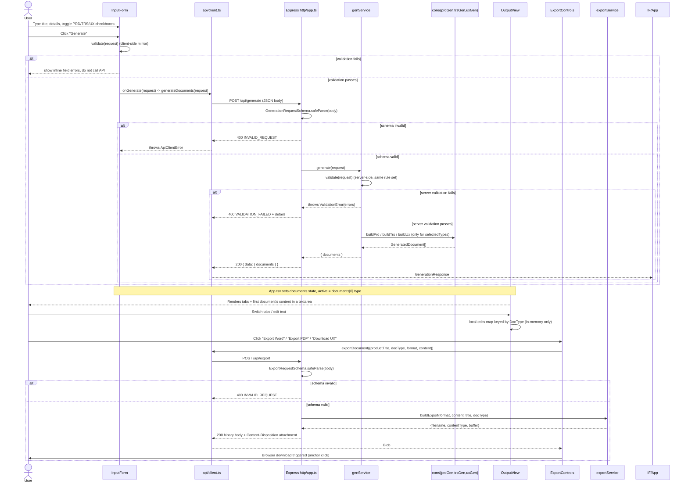
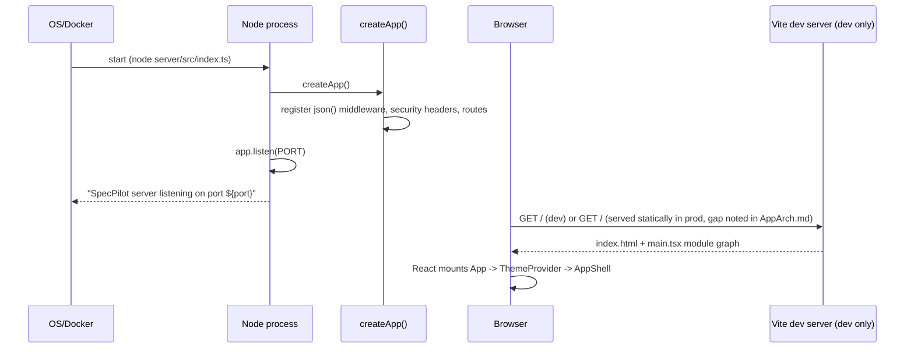

# SpecPilot — Information & Execution Flow

> All statements are **Confirmed** (directly observed in code) unless marked **Inferred** or
> **Unknown**. File references point to exact source locations.

---

## End-to-End Flow

### Application startup

**Backend** (Confirmed — [server/src/index.ts](server/src/index.ts),
[server/src/http/app.ts](server/src/http/app.ts)):
1. Process starts (`node server/src/index.ts`, `vite-node server/src/index.ts` in dev, or the
   Docker `CMD ["node", "--experimental-strip-types", "server/src/index.ts"]` in production).
2. `port` is read from `process.env.PORT`, defaulting to `3000`.
3. `createApp()` is called, which:
   - creates an Express instance,
   - registers `express.json({ limit: "1mb" })` body parsing middleware,
   - registers a middleware that sets security headers (`X-Content-Type-Options: nosniff`,
     `X-Frame-Options: DENY`, `Referrer-Policy: no-referrer`, `Cache-Control: no-store`) on
     every response,
   - registers `GET /health`, `POST /api/generate`, `POST /api/export`.
4. `app.listen(port, ...)` starts the HTTP listener and logs
   `SpecPilot server listening on port ${port}`.

There is no separate "configuration loading" step, no dependency-injection container, and no
database connection to establish — the app is ready to serve traffic as soon as `listen()`'s
callback fires (Confirmed — no async initialization exists in `createApp()` or `index.ts`).

**Frontend** (Confirmed — [web/src/main.tsx](web/src/main.tsx), [index.html](index.html)):
1. The browser loads `index.html`, which sets `data-theme="dark"` on `<html>` (as a
   non-flashing default) and loads `/web/src/main.tsx` as an ES module.
2. `main.tsx` calls `createRoot(document.getElementById("root")!).render(<App/>)` inside
   `<StrictMode>`.
3. `App.tsx` mounts `ThemeProvider` → `AppShell` → `InputForm` + `OutputView` (conditionally
   `ExportControls`).
4. `ThemeProvider`'s effect sets `data-theme="dark"` again (idempotent) and injects a `<style>`
   tag containing the CSS custom properties from `theme/tokens.ts`.
5. Initial React state: `documents = []`, `pending = false`, `active = null`, `error = null` —
   so `OutputView` renders its "No documents generated yet." empty state
   ([web/src/features/output/OutputView.tsx](web/src/features/output/OutputView.tsx)) and no
   `ExportControls` are rendered yet (guarded by `{activeDoc && ...}` in
   [web/src/App.tsx](web/src/App.tsx)).

In development, these two processes run independently (`npm run dev:server` on port 3000,
`npm run dev` for Vite on its own port) and Vite's dev-server proxy
([vite.config.ts](vite.config.ts)) forwards `/api/*` and `/health` to `localhost:3000` so the
browser can call same-origin-looking paths.

---

## User Interaction Flow



**Triggers** (Confirmed):
- `InputForm`'s Generate button `onClick` → `submit()` →
  [web/src/features/input/InputForm.tsx](web/src/features/input/InputForm.tsx).
- `OutputView`'s tab buttons `onClick` → `setActive(doc.type)` →
  [web/src/features/output/OutputView.tsx](web/src/features/output/OutputView.tsx).
- `OutputView`'s `<textarea onChange>` → `onEdit(content)` → updates local `edits` map and
  optionally calls the (currently unused/no-op) `onContentChange` prop passed from `App.tsx`.
- `ExportControls`'s three buttons `onClick` → `run(format)` →
  [web/src/features/export/ExportControls.tsx](web/src/features/export/ExportControls.tsx).

---

## Data Flow

### Generate request
```
User keystrokes (title, details) + checkbox toggles
  → InputForm local state (productTitle, productDetails, selectedTypes)
  → GenerationRequest object literal
  → shared validate() [client-side gate]
  → JSON.stringify via generateDocuments()
  → HTTP POST /api/generate body
  → Express express.json() parses body back to an object
  → GenerationRequestSchema.safeParse() [server-side schema gate]
  → shared validate() [server-side business-rule gate, same rules as client]
  → for each selected DocType: buildPrd|buildTrs|buildUx(request)
      → template interpolation of productTitle/productDetails into fixed section strings
      → GeneratedDocument { type, title, content }
  → GenerationResponse { documents: GeneratedDocument[] }
  → res.json({ data: response })
  → AC: response.json() → body.data as GenerationResponse
  → App.tsx: setDocuments(response.documents); setActive(first type)
  → OutputView renders tabs + content textarea
```

### Export request
```
Current activeDoc (possibly edited) content + productTitle + docType + chosen format
  → ExportRequest object literal
  → JSON.stringify via exportDocument()
  → HTTP POST /api/export body
  → express.json() parses body
  → ExportRequestSchema.safeParse() [schema gate]
  → buildExport(format, content, title, docType) dispatches on format:
      - "word"   -> buildWord(): docx Paragraphs per line -> Packer.toBuffer() -> .docx buffer
      - "pdf"    -> buildPdf(): manual PDF object graph from first 50 lines -> Buffer
      - "mockup" -> buildMockup(): HTML-escaped <pre> wrapped content -> Buffer
  → prefixFilename(title, docType, format) [shared/src/naming.ts] builds e.g. "acme-prd.docx"
  → res.setHeader(Content-Type, ...); res.setHeader(Content-Disposition, attachment; filename=...)
  → res.send(buffer)
  → AC: res.blob() -> Blob
  → ExportControls: triggerBrowserDownload(filename, blob) OR onDownload callback (tests)
  → Browser saves the file (real usage) / test harness inspects it (tests)
```

---

## PRD Generation Flow

(Also generalizes to TRS and UX — same orchestration, different generator function.)

- **Where input comes from**: the `GenerationRequest` submitted from
  [web/src/features/input/InputForm.tsx](web/src/features/input/InputForm.tsx), containing
  `productTitle`, `productDetails`, `selectedTypes` (Confirmed).
- **How it is validated**:
  1. Client-side: `validate()` from `shared/src/validate.ts` runs inside `InputForm.submit()`
     before any network call; failures render inline `<p role="alert">` messages per field and
     **do not** call `onGenerate` (Confirmed).
  2. Server-side, layer 1: `GenerationRequestSchema.safeParse(req.body)` in
     [server/src/http/app.ts](server/src/http/app.ts) enforces the Zod shape (types/enum
     membership) — a structural check, not the business rule ("non-empty") check. Failure →
     `400 INVALID_REQUEST`.
  3. Server-side, layer 2: `genService.generate()` calls the same shared `validate()` function
     again for the business rules (non-empty title/details, ≥1 selected type). Failure throws
     `ValidationError`, caught in the route handler → `400 VALIDATION_FAILED` with `err.errors`
     as `details` (Confirmed).
- **How it is transformed**: `buildPrd(request)` in
  [server/src/core/prdGen.ts](server/src/core/prdGen.ts) maps over the fixed
  `PRD_SECTIONS` tuple (`Problem Statement`, `Business Case`, `Proposed Solution`,
  `Functional Requirements`, `User Personas and their Journey`, `Exclusions`,
  `Success Criteria`, `Assumptions`, `Risks and Dependencies`), calling `sectionBody(section,
  request)` for each — a pure `switch` statement that string-interpolates
  `request.productTitle.trim()` and `request.productDetails.trim()` into hard-coded template
  sentences per section (Confirmed — no external call, no randomness).
- **Any prompt creation**: **None.** There is no LLM prompt construction anywhere in this
  codebase — this is a template/string-interpolation engine, not a prompt-based one
  (Confirmed — see [adr/ADR-DETERMINISTIC.md](adr/ADR-DETERMINISTIC.md), which explicitly
  documents the decision to avoid an LLM).
- **Any LLM calls**: **None** (Confirmed by absence of any HTTP client call, API key handling,
  or model SDK in `server/src`).
- **Response handling**: `genService.generate()` collects the generated `GeneratedDocument`
  objects (only for selected types, in the fixed order PRD → TRS → UX per the `if` statements
  in [server/src/app/genService.ts](server/src/app/genService.ts)) into `{ documents }`, which
  the route handler returns as `res.json({ data: response })`.
- **Output generation** (final artifact): the `content` string on each `GeneratedDocument` is
  Markdown-like plain text: an `# {title} PRD` heading followed by `## {n}. {section}` blocks,
  each with its generated body, joined with blank lines
  ([server/src/core/prdGen.ts](server/src/core/prdGen.ts)). This string is what is displayed in
  `OutputView`'s textarea, what the user edits, and what is later sent back verbatim (plus any
  edits) to `/api/export` to produce the downloadable file.

---

## Conditional Logic

| Condition | Then | Evidence |
| --- | --- | --- |
| IF client-side `validate()` fails | Show per-field alert text; do not call `onGenerate`/API | [web/src/features/input/InputForm.tsx](web/src/features/input/InputForm.tsx) |
| IF `GenerationRequestSchema.safeParse` fails (malformed JSON shape) | Respond `400 INVALID_REQUEST` (no details) | [server/src/http/app.ts](server/src/http/app.ts) |
| IF server-side business `validate()` fails | Respond `400 VALIDATION_FAILED` with `details: FieldError[]` | [server/src/http/app.ts](server/src/http/app.ts), [server/src/app/genService.ts](server/src/app/genService.ts) |
| IF any other error is thrown during generation | Respond `500 GENERATION_FAILED` | [server/src/http/app.ts](server/src/http/app.ts) |
| IF `selectedTypes` includes `"PRD"` / `"TRS"` / `"UX"` | Push the corresponding `GeneratedDocument` to the response array (independently, so any subset/order combination of the three is possible) | [server/src/app/genService.ts](server/src/app/genService.ts) |
| IF `ExportRequestSchema.safeParse` fails | Respond `400 INVALID_REQUEST` | [server/src/http/app.ts](server/src/http/app.ts) |
| IF export building throws (e.g., `docx` packing fails) | Respond `500 EXPORT_FAILED` (generic, no details) | [server/src/http/app.ts](server/src/http/app.ts) |
| IF `format === "word"` | `buildWord()`: one `docx` `Paragraph` per line, packed via `Packer.toBuffer` | [server/src/app/exportService.ts](server/src/app/exportService.ts) |
| IF `format === "pdf"` | `buildPdf()`: first 50 lines only, manual PDF object graph (content is truncated beyond line 50, no error raised) | [server/src/app/exportService.ts](server/src/app/exportService.ts) |
| IF `format === "mockup"` (else branch) | `buildMockup()`: HTML-escape and wrap in `<pre>` | [server/src/app/exportService.ts](server/src/app/exportService.ts) |
| IF `docType === "UX"` | `ExportControls` renders an extra "Download UX" button (format `mockup`) | [web/src/features/export/ExportControls.tsx](web/src/features/export/ExportControls.tsx) |
| IF `documents.length === 0` | `OutputView` renders "No documents generated yet." instead of tabs | [web/src/features/output/OutputView.tsx](web/src/features/output/OutputView.tsx) |
| IF the `documents` prop reference changes (new generation) | `OutputView`'s `useEffect` clears the `edits` map and resets `active` to the first new document's type — this is how FR-REGEN-REPLACE is implemented | [web/src/features/output/OutputView.tsx](web/src/features/output/OutputView.tsx) |
| IF `res.ok` is false in `generateDocuments`/`exportDocument` | Throw `ApiClientError` with the server's `code`/`message` (or `"UNKNOWN"`/`"Request failed."` fallback for `generateDocuments`) | [web/src/api/client.ts](web/src/api/client.ts) |
| IF the `App.tsx` `onGenerate` call throws | `setError(err.message)` and render `<p role="alert">{error}</p>` | [web/src/App.tsx](web/src/App.tsx) |

**Retry paths**: **None found.** No automatic retry logic exists on either client or server
(Confirmed — no retry/backoff code in `api/client.ts` or elsewhere). A failed generate/export
requires the user to click the button again.

---

## State Flow

- **Temporary (in-memory, per-request) state**: everything on the server — the entire
  generate/export pipeline runs and completes within a single request/response cycle with no
  server-side storage of any kind (Confirmed — `NFR-DATA-NOPERSIST`,
  `Cache-Control: no-store` header).
- **Session state (browser, in-memory only, lost on refresh)**:
  - `App.tsx`: `documents`, `pending`, `active`, `error` (React `useState`).
  - `InputForm.tsx`: `productTitle`, `productDetails`, `selectedTypes`, `errors`.
  - `OutputView.tsx`: `active` (current tab) and `edits` (a `Record<DocType, string>` of
    user-edited content, reset whenever a new `documents` array arrives).
  - `ThemeProvider.tsx`: no React state; directly mutates `document.documentElement`'s
    `data-theme` attribute as a side effect.
  - None of this state is persisted to `localStorage`, cookies, or any browser storage API
    (Confirmed — no such API calls found in `web/src`); a page refresh loses all input and
    generated content.
- **Persistent state**: **none exists anywhere in the system** — no database, no file writes,
  no cookies/session store (Confirmed).

---

## Sequence Diagrams

### Startup sequence



### Generate + Export (already shown above as the primary interaction diagram)

---

## Output Generation

**How the final PRD/TRS/UX output is produced, end to end**:

1. **Source inputs**: `productTitle` and `productDetails` strings, plus which of
   `selectedTypes` the user checked.
2. **Processing chain**:
   `InputForm` → `GenerationRequest` → `POST /api/generate` → Zod schema check → business
   `validate()` → `buildPrd`/`buildTrs`/`buildUx` (per selected type) → each generator maps a
   **fixed, ordered list of section names** to a **template string** produced by a `switch`
   statement that interpolates the trimmed title/details.
3. **Intermediate artifacts**: a `GeneratedDocument` per selected type
   (`{ type, title, content }`), assembled into `GenerationResponse.documents` — this is the
   only "document object" that ever exists; there is no separate draft/final distinction.
4. **Final generated document**: the `content` string, rendered directly into an editable
   `<textarea>` in `OutputView`. If the user never edits it, the exported file is built from
   exactly this string; if the user edits it, the export reflects the edited text (the
   `content` value sent in the `ExportRequest` comes from `OutputView`'s local `edits` state,
   passed up through `App.tsx`'s `activeDoc`/`ExportControls` props — Confirmed by tracing
   `value = edits[activeDoc.type] ?? activeDoc.content` in
   [web/src/features/output/OutputView.tsx](web/src/features/output/OutputView.tsx); note,
   however, that `App.tsx` passes `activeDoc.content` — the **original, unedited** content —
   into `ExportControls`, not the edited value, because `App.tsx`'s `onContentChange` handler
   passed to `OutputView` is a no-op (`() => undefined`) and `App.tsx` never captures edits
   into its own state. **This is a functional gap**: edits made in `OutputView` are visually
   present in the textarea but are **not** propagated to `ExportControls`, so exports reflect
   the originally generated text, not the user's edits, contradicting the assumption recorded
   in [Spec.md](Spec.md) ("exports reflect current edited text"). This is a **Confirmed** code
   fact from reading [web/src/App.tsx](web/src/App.tsx) and
   [web/src/features/output/OutputView.tsx](web/src/features/output/OutputView.tsx) together.)
5. The exported **file** itself (Word/PDF/HTML) is a presentation-only transformation of that
   same text — no new content is generated at export time.
