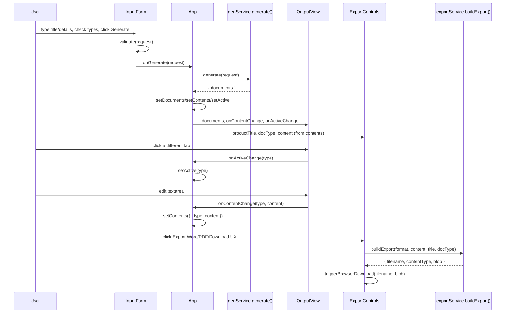

# Flow (Updated) - SpecPilot Data Flow in the XYZ App

## Status

This document describes the **actual, current end-to-end data flow** of the migrated
application: how a user action turns into generated documents, how edits are tracked, and how
export/download works. It supersedes `docs/Flow.md`, which described the old
browser-to-Express-to-browser HTTP flow that no longer exists. Read alongside
`docs/ArchitectureUpdated.md`, which describes the static structure this flow runs through.

**The single most important fact about this flow: there is no network hop anywhere in it.**
Every arrow below is a plain in-process function call or a React state update - never a
`fetch()`, never `/api/*`, never `/_api/*`.

---

## 1. Startup

```text
app/index.html
  -> loads /env-config.js (XYZ runtime config; unused by product logic, present for platform contract)
  -> loads /src/main.tsx
       -> createRoot(#root).render(<App/>)
```

`App` immediately renders `<ThemeProvider>` (sets `data-theme="dark"` on `<html>`) wrapping
`<AppShell>` (renders the "SpecPilot" header + `<HelpPanel/>`), which in turn renders
`<InputForm/>`, `<OutputView/>`, and conditionally `<ExportControls/>`.

At this point: `documents = []`, `contents = {}`, `active = null` - `OutputView` renders
`"No documents generated yet."` and `ExportControls` is not rendered at all (it only renders once
`activeDoc` exists).

## 2. Generate flow

```text
User types Product Title / Product Details, checks PRD/TRS/UX checkboxes
  -> InputForm's local state (productTitle, productDetails, selectedTypes) updates on every keystroke/click

User clicks "Generate"
  -> InputForm.submit()
       -> builds a GenerationRequest = { productTitle, productDetails, selectedTypes }
       -> calls validate(request)  [generation/validate.ts - pure, synchronous]
       -> if invalid: setErrors(result.errors); render <p role="alert"> per field; STOP (onGenerate is not called)
       -> if valid: calls props.onGenerate(request)

  -> App.onGenerate(request)                                    [App.tsx]
       -> setPending(true); setError(null)
       -> try {
            response = generate(request)                        [generation/genService.ts]
              -> validate(request) again (defense in depth; throws ValidationError if it somehow fails here)
              -> if request.selectedTypes includes "PRD": documents.push(buildPrd(request))   [generation/prdGen.ts]
              -> if request.selectedTypes includes "TRS": documents.push(buildTrs(request))   [generation/trsGen.ts]
              -> if request.selectedTypes includes "UX":  documents.push(buildUx(request))    [generation/uxGen.ts]
              -> return { documents }                            [always PRD -> TRS -> UX order, regardless of click order]
            setDocuments(response.documents)
            setContents({ [type]: content, ... })                 [seeds "current content" from freshly generated content]
            setActive(response.documents[0]?.type ?? null)
          } catch (err) {
            setError(err.message)
          } finally {
            setPending(false)
          }
```

Because `generate()` is fully synchronous (no `await`, no I/O), `pending` flips `true` then
`false` within the same tick - there is no visible loading state in practice today. This mirrors
the underlying generators, which are deterministic string-template functions with zero I/O.

**Regeneration semantics:** every `Generate` click replaces `documents` and `contents` wholesale.
`OutputView` has a `useEffect` keyed on the `documents` array reference that resets its own
internal `edits` map and `active` tab whenever `documents` changes - so regenerating always
discards any unsaved edits for *all* document types, even ones that weren't part of the new
request. This matches `docs/Spec.md`'s stated assumption ("regeneration replaces output... after
a confirmation" - no confirmation dialog is currently implemented; this is a known, intentionally
untouched product-open-question, not a migration defect).

## 3. View / switch / edit flow

```text
OutputView renders one <button role="tab"> per entry in `documents`, plus a single <textarea>
for the currently-active document's content.

User clicks a different tab
  -> OutputView.selectTab(type)
       -> setActive(type)                    [OutputView's own internal state - controls which textarea/tab renders]
       -> onActiveChange?.(type)             [reports up to App]
            -> App's setActive(type)         [keeps App.active in sync with what's on screen]

User types in the textarea
  -> OutputView.onEdit(content)
       -> setEdits(current => ({ ...current, [activeDoc.type]: content }))   [OutputView's own edit cache, keyed by DocType]
       -> onContentChange?.(activeDoc.type, content)
            -> App.onContentChange(type, content)
                 -> setContents(current => ({ ...current, [type]: content }))  [App's authoritative "current content" record]
```

Two separate pieces of state track "the current text for a document type" - `OutputView`'s
internal `edits` (drives what the textarea displays) and `App`'s `contents` (drives what gets
exported). They are kept in sync by the `onContentChange` callback firing on every keystroke, so
in practice they always agree; the duplication exists because `OutputView` needs to control its
own textarea's `value` prop (controlled component) independent of whether `App` re-renders.

**Why this matters (regression context):** in the pre-migration app, `App` never wired
`onContentChange` (it was a no-op) and never wired an active-tab callback at all, so `App`'s
`content`/`docType` for the active document were always stale - either the original
un-edited text, or the wrong document type entirely once the user switched tabs. Both gaps are
closed in the current flow (see `docs/ArchitectureUpdated.md` section 5 for the exact bug
descriptions).

## 4. Export flow

```text
ExportControls is rendered only when `activeDoc` exists, receiving:
  - productTitle = activeDoc.title           (the GENERATED document's own title, e.g.
                                               "Acme - Product Requirements Document" - NOT the
                                               raw product-title input; this is unchanged legacy
                                               behavior, see note below)
  - docType      = activeDoc.type
  - content       = App's activeContent = contents[activeDoc.type] ?? activeDoc.content

User clicks "Export Word" / "Export PDF" / "Download UX" (UX-only button)
  -> ExportControls.run(format)
       -> file = await buildExport(format, content, productTitle, docType)   [export/exportService.ts]
            -> format === "word"   -> buildWord(content, title, docType)
                 -> builds docx Document/Paragraph tree (one Paragraph per "\n"-split line)
                 -> blob = await Packer.toBlob(doc)                          [real browser Blob, no Buffer]
            -> format === "pdf"    -> buildPdf(content, title, docType)
                 -> hand-rolled PDF object-graph string (first 50 lines of content only)
                 -> blob = new Blob([pdf], { type: "application/pdf" })
            -> format === "mockup" -> buildMockup(content, title, docType)
                 -> HTML-escaped content wrapped in a minimal <html><pre>...</pre></html> document
                 -> blob = new Blob([html], { type: "text/html" })
            -> filename = prefixFilename(title, docType, format)             [generation/naming.ts]
                 -> sanitizeBase(title) + "-" + docType.toLowerCase() + "." + extension
            -> return { filename, contentType, blob }
       -> if onDownload prop given: onDownload(file.filename, file.blob)     [used by tests to intercept]
       -> else: triggerBrowserDownload(file.filename, file.blob)
            -> url = URL.createObjectURL(blob)
            -> synthetic <a href={url} download={filename}> is appended, clicked, removed
            -> URL.revokeObjectURL(url)
```

**Filename note:** `productTitle` passed into `ExportControls` is actually `activeDoc.title`,
which is the *generated document's own title* (e.g. `"Acme - Product Requirements Document"`),
not the raw text the user typed into the Product Title field. This produces filenames like
`acme-product-requirements-document-prd.docx` rather than the shorter `acme-prd.docx` one might
expect. This is pre-existing behavior carried over unchanged from the original SpecPilot app (not
introduced by the migration) and still satisfies `docs/Spec.md`'s acceptance criterion ("a file
whose name begins with 'Acme'"), so it was intentionally left as-is rather than "fixed" as part of
this migration.

## 5. What is genuinely gone from the old flow

The old `docs/Flow.md` described this path, which **no longer exists anywhere in this
codebase**:

```text
InputForm -> fetch("/api/generate") -> Express -> Zod schema gate -> genService.generate()
  -> JSON response -> App sets documents

ExportControls -> fetch("/api/export") -> Express -> exportService.buildExport()
  -> Buffer -> Content-Disposition header -> browser downloads the HTTP response body
```

Both `POST /api/generate` and `POST /api/export`, the Express app that served them
(`server/src/http/app.ts`), and the SpecPilot-specific `app/src/api/client.ts` that called them
are deleted. The only server-ish thing left in the whole repository is XYZ's own
`app/server.mjs`, which the product's own flow never calls (see
`docs/ArchitectureUpdated.md` section 3.1).

## 6. Error flow

- **Validation failure** (empty title/details, or zero selected types): `InputForm.submit()`
  short-circuits before `onGenerate` is ever called; per-field `<p role="alert">` messages render
  inline. `App.onGenerate` is never invoked, so `App.error` is not involved in this path.
- **Unexpected generation failure** (should not happen given `generate()` is pure, but the
  `try/catch` exists defensively): `App.error` is set from `err.message` and rendered as a single
  `<p role="alert">` above the output area.
- **Export failure:** currently unhandled - `ExportControls.run()` has no `try/catch`, matching
  the pre-migration behavior. A failed export currently fails silently from the UI's perspective
  (the promise rejection is unhandled). This was not introduced by the migration and was not
  changed, consistent with keeping migration and product-quality-improvement work separate.

## 7. Sequence diagram (generate -> edit -> export)


