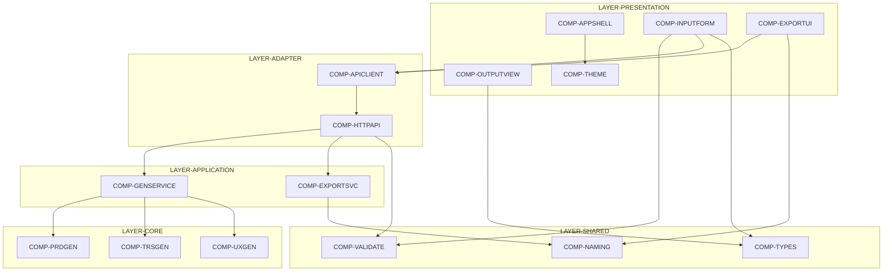
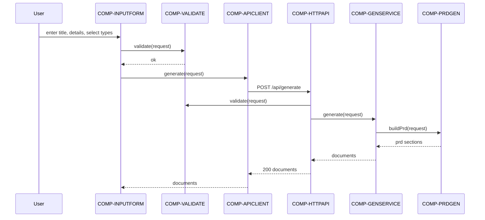
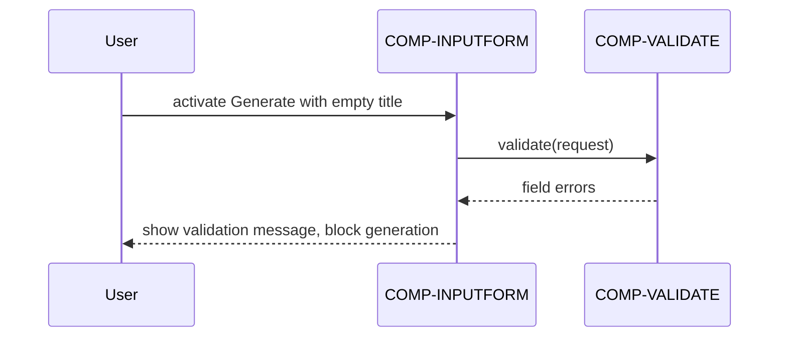
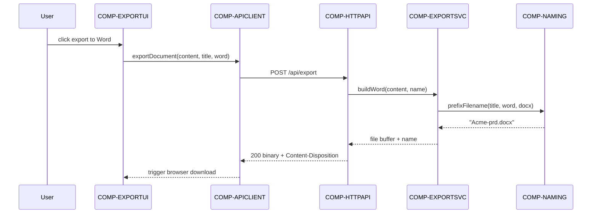
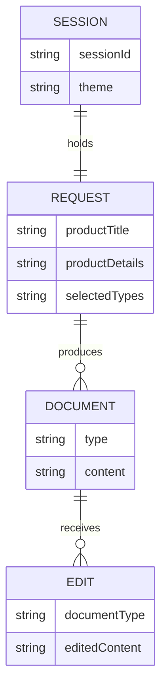

# SpecPilot — Software Design Document

## Overview

SpecPilot is a single-page web application plus a stateless HTTP back-end that turns a
product description into a first-draft PRD, TRS, and UX Design Mockups. The React front-end
captures input, renders segmented output in a dark theme, allows inline editing, and triggers
exports. The Node/Express back-end validates each request, runs deterministic template
generators, and builds Word, PDF, and mockup download files. The system holds no server-side
copy of user content; state lives in the browser session and in produced download files. The
architecture is a layered, dependency-inward design with a pure generation core and a thin
I/O shell, satisfying the requirements in [Spec.md](Spec.md).

Work Scope: Product/system.
Design Depth: HLD.
Implementation Readiness: Decomposable.

## Tech Stack

- Front-end: React 18 with TypeScript, built by Vite 5. Rationale: component model and fast
  bundling suit a single-page app and support NFR-PORT-BROWSER and NFR-USAB-ACCESS.
- Styling: plain CSS with design tokens (CSS custom properties) for a dark-mode-first theme,
  per the darkmode-fullstack-design skill. Rationale: token-driven theming makes WCAG contrast
  auditable for NFR-USAB-ACCESS without a heavy UI framework.
- Back-end: Node.js 20 with Express 4 and TypeScript. Rationale: a small, well-understood HTTP
  layer keeps the generation core framework-agnostic and testable for NFR-PERF-GENLATENCY.
- Validation: Zod schemas shared across front-end and back-end. Rationale: one boundary schema
  enforces FR-INPUT-VALIDATE on both sides and keeps the contract in sync.
- Export: the `docx` library for Word, `pdfkit` for PDF, and a self-contained HTML string for
  UX mockups. Rationale: server-side file building gives consistent output across browsers for
  FR-EXPORT-WORD, FR-EXPORT-PDF, and FR-EXPORT-UXDOWNLOAD.
- Testing: Vitest and React Testing Library for the front-end, Vitest and Supertest for the
  back-end, and axe-core for accessibility checks.
- Packaging: an npm workspaces monorepo (`web`, `server`, `shared`) built into static assets
  and a single Node container image for NFR-DEPLOY-SMOKE.

## Drivers & Constraints

- Functional drivers: FR-INPUT-TITLE, FR-INPUT-DETAILS, FR-INPUT-SELECT, FR-INPUT-VALIDATE,
  FR-GEN-TRIGGER, FR-PRD-SECTIONS, FR-TRS-SECTIONS, FR-UX-SEGMENTS, FR-VIEW-SEGMENTED,
  FR-VIEW-ONLYSELECTED, FR-EDIT-UPDATE, FR-EDIT-PERSISTVIEW, FR-EXPORT-WORD, FR-EXPORT-PDF,
  FR-EXPORT-UXDOWNLOAD, FR-NAME-PREFIX, FR-REGEN-EDITINPUT, FR-REGEN-REPLACE,
  FR-THEME-DARKDEFAULT, and FR-THEME-KEYBOARD.
- Quality drivers: NFR-PERF-GENLATENCY (generation within 10 s), NFR-USAB-ACCESS (WCAG 2.1 AA
  dark theme), NFR-PORT-BROWSER (recent browsers), NFR-DATA-NOPERSIST (no server retention),
  NFR-SEC-TRANSPORT (TLS and session timeout), NFR-SCAL-CONCURRENCY (50 concurrent users),
  NFR-REL-RECOVERY (restart recovery), NFR-DOC-USERHELP (in-app help), and NFR-DEPLOY-SMOKE.
- Use-case drivers: UC-INPUT-ENTER, UC-GEN-RUN, UC-VIEW-SWITCH, UC-EDIT-TEXT,
  UC-EXPORT-WORDPDF, UC-EXPORT-DOWNLOADUX, UC-REGEN-UPDATE, and UC-THEME-USE.
- Constraints: generation is deterministic with no external model provider; the back-end keeps
  no user content beyond the request lifecycle; the release target is one container image plus
  static assets.
- Assumption: exports reflect the user's current edited text rather than the originally
  generated text, recorded in DEC-EXPORTSERVER.

## Layers

- **LAYER-PRESENTATION** — Renders the dark-theme UI and captures user intent. Responsibility:
  React components and theming. Allowed dependencies: LAYER-ADAPTER and LAYER-SHARED only.
  Boundary rule: contains no network or file I/O directly. Ownership: front-end team.
  Classification: presentation.
- **LAYER-ADAPTER** — Bridges the UI and the network boundary. Responsibility: the browser API
  client and the Express HTTP surface. Allowed dependencies: LAYER-APPLICATION and LAYER-SHARED.
  Boundary rule: all HTTP, serialization, and browser-download side effects live here.
  Classification: adapter/shell.
- **LAYER-APPLICATION** — Orchestrates a request into results. Responsibility: generation and
  export orchestration services. Allowed dependencies: LAYER-CORE and LAYER-SHARED.
  Classification: application/orchestration.
- **LAYER-CORE** — Pure deterministic document generation. Responsibility: template generators
  with no I/O. Allowed dependencies: LAYER-SHARED only. Classification: core policy.
- **LAYER-SHARED** — Shared contract, validation, and naming logic used by both front-end and
  back-end. Responsibility: pure types and pure functions. Allowed dependencies: none.
  Classification: core.

Dependency direction is acyclic and points inward: presentation and adapter depend on
application, application depends on core, and every layer may depend on shared.

## Components

- **COMP-APPSHELL** — Root layout, tab container, and in-app help panel. Layer:
  LAYER-PRESENTATION. Depends on IFACE-THEME. State/side-effects: local UI state only.
  Lifecycle: mounted once at app start. Core/shell: presentation. Realizes NFR-PORT-BROWSER,
  NFR-DOC-USERHELP, and UC-VIEW-SWITCH.
- **COMP-INPUTFORM** — Product Title field, Product Details field, document-type selection, and
  Generate action with validation feedback. Layer: LAYER-PRESENTATION. Depends on IFACE-VALIDATE,
  IFACE-APICLIENT, and IFACE-CONTRACT. State/side-effects: local form state. Lifecycle: per
  session. Core/shell: presentation over pure validation. Realizes FR-INPUT-TITLE,
  FR-INPUT-DETAILS, FR-INPUT-SELECT, FR-INPUT-VALIDATE, FR-REGEN-EDITINPUT, and UC-INPUT-ENTER.
- **COMP-OUTPUTVIEW** — Segmented tabbed view for generated PRD, TRS, and UX output with inline
  text editing. Layer: LAYER-PRESENTATION. Depends on IFACE-CONTRACT. State/side-effects:
  in-memory edited content per document type. Lifecycle: per session. Core/shell: presentation.
  Realizes FR-VIEW-SEGMENTED, FR-VIEW-ONLYSELECTED, FR-EDIT-UPDATE, FR-EDIT-PERSISTVIEW,
  FR-REGEN-REPLACE, UC-VIEW-SWITCH, and UC-EDIT-TEXT.
- **COMP-EXPORTUI** — Export-to-Word, export-to-PDF, and download-mockups controls. Layer:
  LAYER-PRESENTATION. Depends on IFACE-APICLIENT, IFACE-NAMING, and IFACE-CONTRACT.
  State/side-effects: triggers a browser download of the returned file. Lifecycle: per session.
  Core/shell: presentation over shell download. Realizes FR-EXPORT-WORD, FR-EXPORT-PDF,
  FR-EXPORT-UXDOWNLOAD, UC-EXPORT-WORDPDF, and UC-EXPORT-DOWNLOADUX.
- **COMP-THEME** — Dark-theme token provider, focus-visible styling, and contrast tokens. Layer:
  LAYER-PRESENTATION. Depends on nothing outside its layer. State/side-effects: sets the
  `data-theme` attribute. Lifecycle: app start. Core/shell: presentation. Realizes
  FR-THEME-DARKDEFAULT, FR-THEME-KEYBOARD, NFR-USAB-ACCESS, and UC-THEME-USE.
- **COMP-APICLIENT** — Browser client that calls the back-end over HTTPS and maps the error
  envelope. Layer: LAYER-ADAPTER. Depends on IFACE-GENAPI, IFACE-EXPORTAPI, and IFACE-CONTRACT.
  State/side-effects: network calls. Lifecycle: per call. Core/shell: shell. Realizes
  FR-GEN-TRIGGER and UC-GEN-RUN.
- **COMP-TYPES** — Shared request and response schema and TypeScript types for the front-end and
  back-end contract. Layer: LAYER-SHARED. Depends on nothing. State/side-effects: none, pure.
  Lifecycle: compile time. Core/shell: core. Realizes FR-GEN-TRIGGER and UC-GEN-RUN.
- **COMP-VALIDATE** — Pure validation of a generation request: non-empty title, non-empty
  details, and at least one selected type. Layer: LAYER-SHARED. Depends on IFACE-CONTRACT.
  State/side-effects: none, pure. Lifecycle: per call. Core/shell: core. Realizes
  FR-INPUT-VALIDATE and UC-INPUT-ENTER.
- **COMP-NAMING** — Pure filename builder that prefixes the sanitized Product Title. Layer:
  LAYER-SHARED. Depends on IFACE-CONTRACT. State/side-effects: none, pure. Lifecycle: per call.
  Core/shell: core. Realizes FR-NAME-PREFIX and UC-EXPORT-WORDPDF.
- **COMP-HTTPAPI** — Express controllers and middleware for generate and export endpoints,
  including validation, the error envelope, security headers, and the health/smoke route. Layer:
  LAYER-ADAPTER. Depends on IFACE-GENSVC, IFACE-EXPORTSVC, IFACE-VALIDATE, and IFACE-CONTRACT.
  State/side-effects: HTTP I/O, no persistence. Lifecycle: per request. Core/shell: shell.
  Realizes FR-GEN-TRIGGER, NFR-SEC-TRANSPORT, NFR-SCAL-CONCURRENCY, NFR-REL-RECOVERY,
  NFR-DEPLOY-SMOKE, NFR-DATA-NOPERSIST, and UC-GEN-RUN.
- **COMP-GENSERVICE** — Orchestrates validation and the selected generators and assembles the
  response. Layer: LAYER-APPLICATION. Depends on IFACE-PRDGEN, IFACE-TRSGEN, IFACE-UXGEN,
  IFACE-VALIDATE, and IFACE-CONTRACT. State/side-effects: none beyond in-memory composition.
  Lifecycle: per request. Core/shell: application. Realizes FR-GEN-TRIGGER, FR-REGEN-REPLACE,
  NFR-PERF-GENLATENCY, NFR-DATA-NOPERSIST, and UC-GEN-RUN.
- **COMP-PRDGEN** — Deterministic PRD generator producing the nine ordered sections. Layer:
  LAYER-CORE. Depends on IFACE-CONTRACT. State/side-effects: none, pure. Lifecycle: per call.
  Core/shell: core. Realizes FR-PRD-SECTIONS and UC-GEN-RUN.
- **COMP-TRSGEN** — Deterministic TRS generator producing the twelve ordered sections. Layer:
  LAYER-CORE. Depends on IFACE-CONTRACT. State/side-effects: none, pure. Lifecycle: per call.
  Core/shell: core. Realizes FR-TRS-SECTIONS and UC-GEN-RUN.
- **COMP-UXGEN** — Deterministic UX mockup generator producing the user-journeys segment and the
  UI-mockups segment. Layer: LAYER-CORE. Depends on IFACE-CONTRACT. State/side-effects: none,
  pure. Lifecycle: per call. Core/shell: core. Realizes FR-UX-SEGMENTS and UC-GEN-RUN.
- **COMP-EXPORTSVC** — Builds a Word document, a PDF document, or a self-contained mockup file
  from provided content and a prefixed filename. Layer: LAYER-APPLICATION. Depends on
  IFACE-NAMING and IFACE-CONTRACT. State/side-effects: in-memory file buffers via export
  libraries. Lifecycle: per request. Core/shell: mixed application over shell libraries. Realizes
  FR-EXPORT-WORD, FR-EXPORT-PDF, FR-EXPORT-UXDOWNLOAD, UC-EXPORT-WORDPDF, and
  UC-EXPORT-DOWNLOADUX.

## Interfaces

- **IFACE-CONTRACT** — Shared request/response schema: a generation request (title, details,
  selected types) and a generation response (per-type documents). Owner: COMP-TYPES. Protocol:
  in-process TypeScript types and a Zod schema. Errors: schema parse errors. Versioning: additive
  fields only. Consumed by COMP-INPUTFORM, COMP-OUTPUTVIEW, COMP-EXPORTUI, COMP-APICLIENT,
  COMP-VALIDATE, COMP-NAMING, COMP-HTTPAPI, and COMP-GENSERVICE.
- **IFACE-VALIDATE** — `validate(request): Result` returning ok or field errors.
  Owner: COMP-VALIDATE. Protocol: pure function. Errors: structured field-error list.
  Consumed by COMP-INPUTFORM, COMP-HTTPAPI, and COMP-GENSERVICE.
- **IFACE-NAMING** — `prefixFilename(title, type, extension): string` producing a sanitized,
  title-prefixed name. Owner: COMP-NAMING. Protocol: pure function. Errors: none; empty title
  falls back to a default base name. Consumed by COMP-EXPORTUI and COMP-EXPORTSVC.
- **IFACE-APICLIENT** — Browser-side methods `generate(request)` and `exportDocument(payload)`.
  Owner: COMP-APICLIENT. Protocol: HTTPS fetch returning typed results or a mapped error. Errors:
  network and error-envelope mapping. Consumed by COMP-INPUTFORM and COMP-EXPORTUI.
- **IFACE-GENAPI** — `POST /api/generate` accepting a request and returning generated documents.
  Owner: COMP-HTTPAPI. Protocol: JSON over HTTPS. Auth: none in this scope; TLS required. Errors:
  400 on validation failure with the error envelope, 500 on unexpected failure. Consumed by
  COMP-APICLIENT.
- **IFACE-EXPORTAPI** — `POST /api/export` returning a Word, PDF, or mockup file as a binary
  download. Owner: COMP-HTTPAPI. Protocol: JSON request, binary response with
  Content-Disposition. Errors: 400 on invalid payload, 500 on build failure. Consumed by
  COMP-APICLIENT.
- **IFACE-GENSVC** — `generate(request): GenerationResponse` orchestrating the selected
  generators. Owner: COMP-GENSERVICE. Protocol: in-process call. Errors: propagates validation
  errors. Consumed by COMP-HTTPAPI.
- **IFACE-PRDGEN** — `buildPrd(request): PrdDocument` with nine ordered sections.
  Owner: COMP-PRDGEN. Protocol: pure function. Errors: none for valid input.
  Consumed by COMP-GENSERVICE.
- **IFACE-TRSGEN** — `buildTrs(request): TrsDocument` with twelve ordered sections.
  Owner: COMP-TRSGEN. Protocol: pure function. Errors: none for valid input.
  Consumed by COMP-GENSERVICE.
- **IFACE-UXGEN** — `buildUx(request): UxDocument` with a journeys segment and a UI-mockups
  segment. Owner: COMP-UXGEN. Protocol: pure function. Errors: none for valid input. Consumed by
  COMP-GENSERVICE.
- **IFACE-EXPORTSVC** — `buildWord(content, name)`, `buildPdf(content, name)`, and
  `buildMockup(content, name)` returning a file buffer and filename. Owner: COMP-EXPORTSVC.
  Protocol: in-process call over export libraries. Errors: build failure surfaced to the caller.
  Consumed by COMP-HTTPAPI.
- **IFACE-THEME** — Theme provider exposing dark tokens and focus styles. Owner: COMP-THEME.
  Protocol: React context and CSS custom properties. Errors: none. Consumed by COMP-APPSHELL.

## Core vs. Shell

| Component | Classification | Pure decisions / rules | I/O and side effects | How tested |
| --- | --- | --- | --- | --- |
| COMP-TYPES | core | Contract types and schema | None | Type and schema unit tests |
| COMP-VALIDATE | core | Request validation rules | None | Pure unit tests |
| COMP-NAMING | core | Filename prefix and sanitization | None | Pure unit tests |
| COMP-PRDGEN | core | PRD section templating | None | Golden-output unit tests |
| COMP-TRSGEN | core | TRS section templating | None | Golden-output unit tests |
| COMP-UXGEN | core | UX segment templating | None | Golden-output unit tests |
| COMP-GENSERVICE | application | Generator selection and assembly | None | Unit tests with fake generators |
| COMP-EXPORTSVC | mixed | File-model assembly | Export library buffers | Unit tests over buffers |
| COMP-HTTPAPI | shell | Status/error mapping | HTTP, headers, health route | Supertest integration tests |
| COMP-APICLIENT | shell | Error-envelope mapping | Fetch, downloads | Mocked-network tests |
| COMP-INPUTFORM | presentation | Field/selection state | DOM events | Component tests |
| COMP-OUTPUTVIEW | presentation | Segment and edit state | DOM events | Component tests |
| COMP-EXPORTUI | presentation | Export action state | Browser download | Component tests |
| COMP-THEME | presentation | Token and focus rules | `data-theme` attribute | Accessibility tests |
| COMP-APPSHELL | presentation | Layout and tab state | Mount | Component tests |

Dependencies point inward or through interfaces: presentation and adapter components call
core and application components only through the interfaces above, so side effects stay in the
adapter and application layers while decisions stay pure and independently testable.

## Key Flows

Generation flow for UC-GEN-RUN:

Validation-failure flow for UC-INPUT-ENTER:

Export flow for UC-EXPORT-WORDPDF:

## Data Model

The back-end persists no user content, satisfying NFR-DATA-NOPERSIST. The only stateful data
is the browser session state described below; produced files leave the system as downloads.

Retention: session data is discarded when the tab closes; the back-end retains a request only
for the duration of the HTTP call. Privacy classification: user-authored text is treated as
confidential in transit and never written to a server store.

## Design Decisions

- **DEC-STACK** — Use React with Vite and Express with TypeScript in an npm workspaces monorepo.
  Alternatives: Next.js full-stack; a Python FastAPI back-end. Input: user selected React plus
  Node/Express. Rationale: a clear front-end/back-end split with a shared package supports the
  layered design and shared contract. Quality attributes: modifiability and testability.
  Consequences: two build targets to maintain. Reversibility: moderate. Revisit trigger: a need
  for server-side rendering.
- **DEC-DETERMINISTIC** — Generate documents from deterministic templates with no external model
  provider. Alternatives: call a hosted language model. Input: user chose an offline generator.
  Rationale: predictable output, no key management, testable golden output for NFR-PERF-GENLATENCY.
  Consequences: output quality is template-bound. Reversibility: high behind IFACE-GENSVC.
  Revisit trigger: a request for model-generated prose. Recorded in ADR
  [adr/ADR-DETERMINISTIC.md](adr/ADR-DETERMINISTIC.md).
- **DEC-EXPORTSERVER** — Build Word, PDF, and mockup files on the back-end and stream them as
  downloads, exporting the current edited text. Alternatives: build files in the browser.
  Rationale: consistent output across browsers for FR-EXPORT-WORD, FR-EXPORT-PDF, and
  FR-EXPORT-UXDOWNLOAD. Consequences: export payloads cross the network. Reversibility: moderate.
  Revisit trigger: an offline-export requirement.
- **DEC-NOPERSIST** — Keep the back-end stateless with no user-content store. Alternatives: store
  drafts server-side. Rationale: satisfies NFR-DATA-NOPERSIST and reduces the data-protection
  surface. Consequences: no server-side draft recovery. Reversibility: high. Revisit trigger: a
  save-and-resume requirement.
- **DEC-DARKONLY** — Ship a dark theme only, built on swappable tokens. Alternatives: dual light
  and dark themes. Rationale: matches UN-ACCESS-COMFORT scope while keeping a future light theme
  a token swap. Consequences: no light mode now. Reversibility: high. Revisit trigger: a light
  theme request.
- **DEC-MONOREPO** — Share the contract, validation, and naming logic in a `shared` workspace.
  Alternatives: duplicate types per app. Rationale: one source of truth for IFACE-CONTRACT keeps
  the front-end and back-end aligned. Consequences: a shared build step. Reversibility: moderate.

## Test Strategy

Test levels map to components and acceptance tests as follows.

| Component | Test levels | Key checks and traceability |
| --- | --- | --- |
| COMP-TYPES | unit | Schema parses valid and rejects invalid requests |
| COMP-VALIDATE | unit | FR-INPUT-VALIDATE via AT-INPUT-VALIDATE |
| COMP-NAMING | unit | FR-NAME-PREFIX via AT-EXPORT-WORDPDF |
| COMP-PRDGEN | unit | FR-PRD-SECTIONS section order via AT-PRD-SECTIONS |
| COMP-TRSGEN | unit | FR-TRS-SECTIONS section order via AT-TRS-SECTIONS |
| COMP-UXGEN | unit | FR-UX-SEGMENTS segments via AT-UX-SEGMENTS |
| COMP-GENSERVICE | unit, integration | FR-GEN-TRIGGER selection via AT-GEN-SELECTED; NFR-PERF-GENLATENCY timing |
| COMP-EXPORTSVC | unit | FR-EXPORT-WORD, FR-EXPORT-PDF, FR-EXPORT-UXDOWNLOAD buffers |
| COMP-HTTPAPI | integration, contract | IFACE-GENAPI and IFACE-EXPORTAPI over Supertest; NFR-SEC-TRANSPORT headers; NFR-DEPLOY-SMOKE health route; NFR-DATA-NOPERSIST no-store assertion |
| COMP-APICLIENT | unit | Error-envelope mapping with mocked network |
| COMP-INPUTFORM | component | FR-INPUT-TITLE, FR-INPUT-DETAILS, FR-INPUT-SELECT via AT-INPUT-ENTER; FR-REGEN-EDITINPUT via AT-REGEN-UPDATE |
| COMP-OUTPUTVIEW | component | FR-VIEW-SEGMENTED, FR-VIEW-ONLYSELECTED via AT-VIEW-SWITCH; FR-EDIT-UPDATE, FR-EDIT-PERSISTVIEW via AT-EDIT-TEXT; FR-REGEN-REPLACE via AT-REGEN-UPDATE |
| COMP-EXPORTUI | component | FR-EXPORT-WORD, FR-EXPORT-PDF via AT-EXPORT-WORDPDF; FR-EXPORT-UXDOWNLOAD via AT-EXPORT-UX |
| COMP-THEME | accessibility | FR-THEME-DARKDEFAULT, FR-THEME-KEYBOARD, NFR-USAB-ACCESS via AT-THEME-USE using axe-core |
| COMP-APPSHELL | component | NFR-PORT-BROWSER render and NFR-DOC-USERHELP help panel |

Acceptance tests AT-INPUT-ENTER, AT-INPUT-VALIDATE, AT-GEN-SELECTED, AT-PRD-SECTIONS,
AT-TRS-SECTIONS, AT-UX-SEGMENTS, AT-VIEW-SWITCH, AT-EDIT-TEXT, AT-EXPORT-WORDPDF, AT-EXPORT-UX,
AT-REGEN-UPDATE, AT-THEME-USE, and AT-PERF-GEN run as end-to-end checks over the running app.
Build verification runs the workspace build; deployment validation runs the container smoke
check against the health route for NFR-DEPLOY-SMOKE. Documentation checks confirm the in-app
help content for NFR-DOC-USERHELP and validate the README build instructions.

## Risks & Trade-offs

- **RISK-EXPORTFIDELITY** — Word and PDF layout may differ from the on-screen view. Impact:
  medium. Likelihood: medium. Mitigation: golden-file tests on generated buffers and a fixed
  template. Owner: back-end. Trigger: layout complaints. Residual: minor styling gaps.
- **RISK-DETERMINISM** — Deterministic templates may feel generic to users expecting model-grade
  prose. Impact: medium. Likelihood: medium. Mitigation: rich templates behind IFACE-GENSVC to
  allow a later model adapter, per DEC-DETERMINISTIC. Owner: product. Trigger: user feedback.
  Residual: template-bound tone.
- **RISK-A11Y** — Dark-theme contrast or focus handling may miss WCAG 2.1 AA. Impact: high.
  Likelihood: low. Mitigation: token-defined contrast and automated axe-core checks per
  NFR-USAB-ACCESS. Owner: front-end. Trigger: failed accessibility scan. Residual: low.
- **RISK-SCOPECREEP** — Requests for accounts or saved drafts would break the stateless model.
  Impact: medium. Likelihood: medium. Mitigation: DEC-NOPERSIST recorded and revisit trigger
  noted. Owner: product. Trigger: a save-and-resume request. Residual: contained by the decision.

## Traceability Matrix

| Requirement | Component(s) | Interface(s) | Decision/Tactic | Test/Check |
| --- | --- | --- | --- | --- |
| FR-INPUT-TITLE | COMP-INPUTFORM | IFACE-CONTRACT | DEC-MONOREPO | AT-INPUT-ENTER |
| FR-INPUT-DETAILS | COMP-INPUTFORM | IFACE-CONTRACT | DEC-MONOREPO | AT-INPUT-ENTER |
| FR-INPUT-SELECT | COMP-INPUTFORM | IFACE-CONTRACT | DEC-MONOREPO | AT-INPUT-ENTER |
| FR-INPUT-VALIDATE | COMP-VALIDATE, COMP-INPUTFORM | IFACE-VALIDATE | DEC-MONOREPO | AT-INPUT-VALIDATE |
| FR-GEN-TRIGGER | COMP-APICLIENT, COMP-HTTPAPI, COMP-GENSERVICE | IFACE-GENAPI, IFACE-GENSVC | DEC-STACK | AT-GEN-SELECTED |
| FR-PRD-SECTIONS | COMP-PRDGEN | IFACE-PRDGEN | DEC-DETERMINISTIC | AT-PRD-SECTIONS |
| FR-TRS-SECTIONS | COMP-TRSGEN | IFACE-TRSGEN | DEC-DETERMINISTIC | AT-TRS-SECTIONS |
| FR-UX-SEGMENTS | COMP-UXGEN | IFACE-UXGEN | DEC-DETERMINISTIC | AT-UX-SEGMENTS |
| FR-VIEW-SEGMENTED | COMP-OUTPUTVIEW | IFACE-CONTRACT | DEC-DARKONLY | AT-VIEW-SWITCH |
| FR-VIEW-ONLYSELECTED | COMP-OUTPUTVIEW | IFACE-CONTRACT | DEC-DARKONLY | AT-VIEW-SWITCH |
| FR-EDIT-UPDATE | COMP-OUTPUTVIEW | IFACE-CONTRACT | DEC-DARKONLY | AT-EDIT-TEXT |
| FR-EDIT-PERSISTVIEW | COMP-OUTPUTVIEW | IFACE-CONTRACT | DEC-DARKONLY | AT-EDIT-TEXT |
| FR-EXPORT-WORD | COMP-EXPORTSVC, COMP-EXPORTUI | IFACE-EXPORTSVC, IFACE-EXPORTAPI | DEC-EXPORTSERVER | AT-EXPORT-WORDPDF |
| FR-EXPORT-PDF | COMP-EXPORTSVC, COMP-EXPORTUI | IFACE-EXPORTSVC, IFACE-EXPORTAPI | DEC-EXPORTSERVER | AT-EXPORT-WORDPDF |
| FR-EXPORT-UXDOWNLOAD | COMP-EXPORTSVC, COMP-EXPORTUI | IFACE-EXPORTSVC, IFACE-EXPORTAPI | DEC-EXPORTSERVER | AT-EXPORT-UX |
| FR-NAME-PREFIX | COMP-NAMING | IFACE-NAMING | DEC-EXPORTSERVER | AT-EXPORT-WORDPDF |
| FR-REGEN-EDITINPUT | COMP-INPUTFORM | IFACE-APICLIENT | DEC-STACK | AT-REGEN-UPDATE |
| FR-REGEN-REPLACE | COMP-OUTPUTVIEW, COMP-GENSERVICE | IFACE-GENSVC | DEC-STACK | AT-REGEN-UPDATE |
| FR-THEME-DARKDEFAULT | COMP-THEME | IFACE-THEME | DEC-DARKONLY | AT-THEME-USE |
| FR-THEME-KEYBOARD | COMP-THEME | IFACE-THEME | DEC-DARKONLY | AT-THEME-USE |
| NFR-PERF-GENLATENCY | COMP-GENSERVICE | IFACE-GENSVC | DEC-DETERMINISTIC | AT-PERF-GEN |
| NFR-REL-RECOVERY | COMP-HTTPAPI | IFACE-GENAPI | DEC-NOPERSIST | Integration restart test |
| NFR-SCAL-CONCURRENCY | COMP-HTTPAPI | IFACE-GENAPI | DEC-NOPERSIST | Load test |
| NFR-SEC-TRANSPORT | COMP-HTTPAPI | IFACE-GENAPI | DEC-STACK | Header and timeout test |
| NFR-USAB-ACCESS | COMP-THEME | IFACE-THEME | DEC-DARKONLY | AT-THEME-USE |
| NFR-PORT-BROWSER | COMP-APPSHELL | IFACE-THEME | DEC-STACK | Cross-browser test |
| NFR-DATA-NOPERSIST | COMP-HTTPAPI, COMP-GENSERVICE | IFACE-GENSVC | DEC-NOPERSIST | No-store assertion |
| NFR-DOC-USERHELP | COMP-APPSHELL | IFACE-THEME | DEC-DARKONLY | Help-content check |
| NFR-DEPLOY-SMOKE | COMP-HTTPAPI | IFACE-GENAPI | DEC-STACK | Container smoke check |
